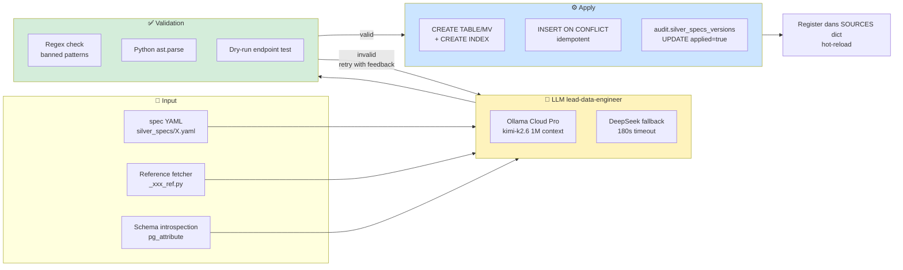
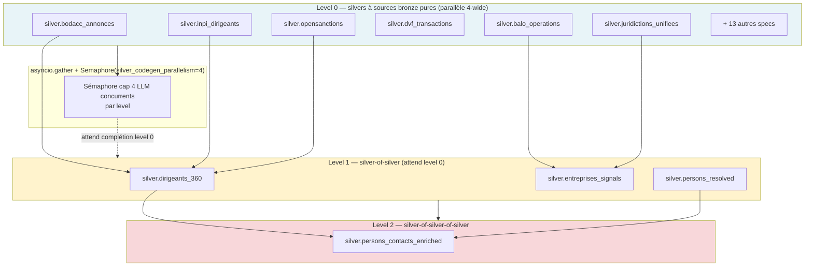
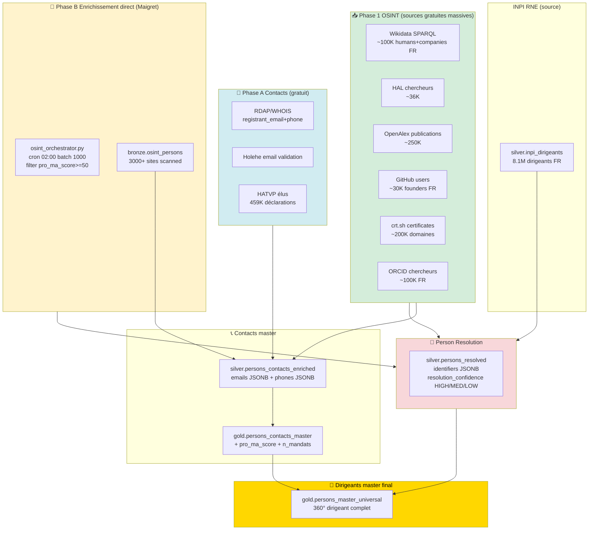
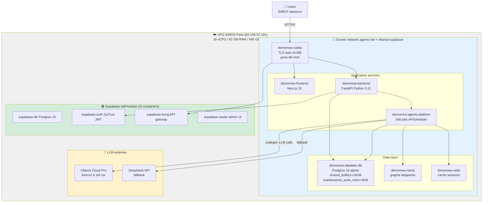
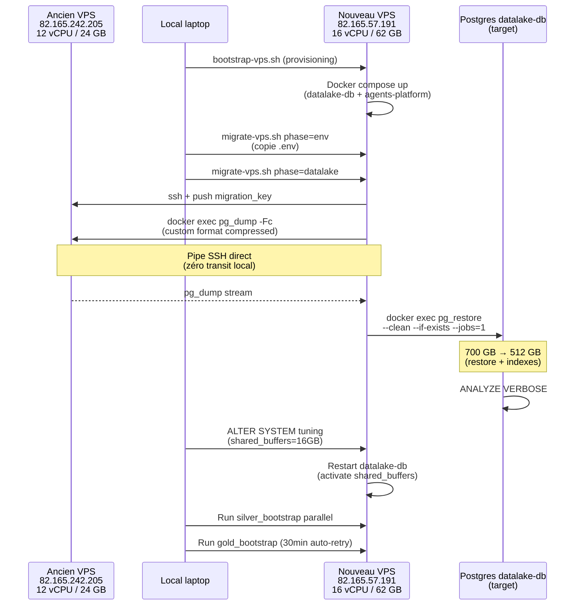
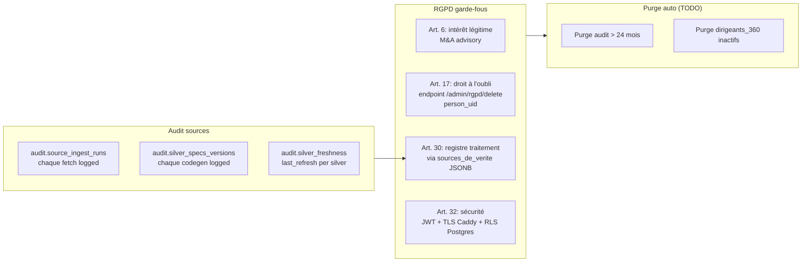

# 🎨 Architecture Diagrams — DEMOEMA (Mermaid)

> **Diagrammes architecture du projet DEMOEMA** au 29/04/2026.
> Rendu : GitHub, Confluence (avec macro Mermaid), Notion, VS Code (extension Markdown Preview Mermaid).

---

## 1. Vue d'ensemble — Medallion architecture

Pipeline complet bronze → silver → gold → API → frontend, avec les volumes actuels.

```mermaid
flowchart TB
    subgraph SOURCES["📡 Sources externes (109+ sources cataloguées)"]
        INSEE[INSEE SIRENE<br/>43M étab]
        INPI[INPI RNE<br/>8M dirigeants]
        BODACC[BODACC OpenData<br/>30M annonces]
        DILA[DILA OpenData<br/>11 onglets juri+M&A]
        OSINT[OSINT Phase 1<br/>Wikidata/HAL/GitHub/crt.sh]
        OTHER[+90 autres sources]
    end

    subgraph BRONZE["🥉 BRONZE — Raw data (115 tables, 512 GB)"]
        B_INPI[bronze.inpi_*<br/>410M+ rows]
        B_BODACC[bronze.bodacc_*<br/>30M rows]
        B_DILA[bronze.juri_*<br/>+ amf_dila + balo + etc.]
        B_OSINT[bronze.osint_*<br/>+ wikidata + github + ...]
    end

    subgraph SILVER["🥈 SILVER — Cleaned + normalized (29 specs)"]
        S_BASE[silver.inpi_dirigeants 8.1M<br/>silver.insee_etablissements 43M<br/>silver.opensanctions 280K]
        S_MA[silver.dirigeants_360<br/>silver.entreprises_signals<br/>+ 11 silvers M&A]
        S_OSINT[silver.persons_resolved<br/>silver.persons_contacts_enriched]
    end

    subgraph GOLD["🥇 GOLD — Feature store (13 specs)"]
        G_MASTER[gold.entreprises_master<br/>gold.dirigeants_master<br/>gold.cibles_ma_top]
        G_FEED[gold.signaux_ma_feed<br/>gold.compliance_red_flags]
        G_CONTACTS[gold.persons_contacts_master]
        G_ENRICH[gold.juridictions_master<br/>gold.network_mandats<br/>+ 5 autres]
    end

    subgraph API["🔌 API FastAPI"]
        A_REST[REST endpoints<br/>/api/entreprises/*<br/>/api/dirigeants/*<br/>/api/contentieux/*]
        A_SSE[Server-Sent Events<br/>copilot streaming]
        A_AUTH[Auth Supabase JWT]
    end

    subgraph FRONT["💻 Frontend Next.js 15"]
        F_DASH[Dashboard]
        F_TARGETS[Intelligence Targets<br/>cibles_ma_top]
        F_SIGNALS[Feed Signaux<br/>signaux_ma_feed]
        F_GRAPH[Graphe Réseau<br/>network_mandats]
        F_COPILOT[Copilot IA]
    end

    SOURCES --> BRONZE
    BRONZE -->|silver_codegen LLM<br/>parallèle 4-wide| SILVER
    SILVER -->|gold_codegen LLM<br/>parallèle 4-wide| GOLD
    GOLD --> API
    API --> FRONT

    classDef bronze fill:#cd7f32,color:#fff
    classDef silver fill:#c0c0c0,color:#000
    classDef gold fill:#ffd700,color:#000
    classDef api fill:#3498db,color:#fff
    classDef front fill:#9b59b6,color:#fff

    class BRONZE bronze
    class SILVER silver
    class GOLD gold
    class API api
    class FRONT front
```



---

## 2. Codegen pipeline — Comment les fetchers/silvers/golds sont générés

L'agent `lead-data-engineer` (LLM Ollama Cloud + DeepSeek fallback) lit les specs YAML et génère le SQL/Python automatiquement.



---

## 3. Parallélisation topologique silver bootstrap (commit 2932c77)

Silver bootstrap utilise Kahn topological sort pour exploiter les dépendances en parallèle 4-wide.



**Bénéfice** : 70 min séquentiel → ~30 min parallèle 4-wide sur fresh boot.

---

## 4. OSINT enrichment pipeline — comment les dirigeants sont enrichis



---

## 5. Architecture infrastructure (VPS + containers)



---

## 6. Refresh schedules — quand chaque layer se met à jour

Timeline des jobs APScheduler par 24h.

```mermaid
gantt
    title Refresh schedules DEMOEMA — 24h timeline
    dateFormat HH:mm
    axisFormat %H:%M

    section Bronze
    109 sources cron individuel        :08:00, 24h
    Bronze codegen tick (5 min)         :crit, 00:00, 24h
    Bronze maintainer (6h)              :02:00, 6h

    section Silver
    Silver bootstrap (au boot)          :milestone, 06:00, 0
    Silver maintainer (30 min)          :crit, 00:00, 24h
    Silver refresh dirigeants_360       :03:00, 1h
    Silver refresh entreprises_signals  :03:30, 1h

    section Gold
    Gold bootstrap retry (30 min)       :crit, 00:00, 24h
    Gold refresh entreprises_master     :03:00, 1h
    Gold refresh dirigeants_master      :03:30, 1h
    Gold refresh cibles_ma_top          :04:00, 1h
    Gold refresh signaux_ma_feed        :crit, 00:00, 24h

    section OSINT
    OSINT Maigret nightly batch 1000    :02:00, 4h
    OSINT Phase 1 sources (cron weekly) :milestone, 06:00, 0

    section Misc
    Neo4j rebuild                       :04:00, 1h
    Supervisor daily report             :08:00, 30m
    DILA backfill (hebdo)               :milestone, 06:00, 0
```



---

## 7. Sources DILA OpenData (couche 5)

```mermaid
flowchart LR
    subgraph DILA["📂 https://echanges.dila.gouv.fr/OPENDATA/"]
        D_BODACC[BODACC]
        D_CASS[CASS]
        D_CAPP[CAPP]
        D_JADE[JADE]
        D_CONSTIT[CONSTIT]
        D_AMF[AMF]
        D_BALO[BALO]
        D_LEGI[LEGI]
        D_JORF[JORF]
        D_KALI[KALI]
        D_DOLE[DOLE]
        D_BOCC[BOCC]
    end

    subgraph FETCHERS["fetchers tar_gz_xml (généré par codegen)"]
        F_PATTERN[_tar_gz_xml_ref.py reference<br/>asyncio.Semaphore=4 archives parallèles<br/>tarfile.open + lxml.etree.fromstring]
    end

    subgraph BRONZE_DILA["Bronze tables"]
        B_BODACC2[bodacc_annonces_raw 30M]
        B_CASS2[judilibre_decisions_raw 145K]
        B_JADE2[juri_jade_raw 14K]
        B_AMF2[amf_dila_raw 29K]
        B_LEGI2[legifrance_textes_raw 235K]
        B_JORF2[jorf_textes_raw 309K]
        B_KALI2[kali_ccn_raw 158K]
    end

    DILA --> FETCHERS
    FETCHERS --> BRONZE_DILA

    style DILA fill:#e3f2fd
    style FETCHERS fill:#fff3cd
    style BRONZE_DILA fill:#cd7f32,color:#fff
```



---

## 8. Scoring M&A composite — comment pro_ma_score est calculé

```mermaid
flowchart TB
    subgraph FEATURES["Features par dimension"]
        F_MANDATS[Mandats: n_mandats_actifs, sirens[]]
        F_PATRIMOINE[Patrimoine SCI: total_capital_sci]
        F_FINANCIER[Financier: ca_total, resultat_net]
        F_RESEAU[Réseau: n_co_mandataires]
        F_BODACC[Événements BODACC: cessions, difficultés]
        F_LEGAL[Légal: n_jugements]
        F_SANCTIONS[Sanctions: opensanctions match]
        F_PRESSE[Presse: n_press_mentions_90d]
        F_DIGITAL[Digital: digital_presence_score]
    end

    subgraph FORMULA["score = LEAST(100, ...)"]
        SCORE[pro_ma_score 0-100]
    end

    F_MANDATS -->|+10 si is_pro_ma| FORMULA
    F_PATRIMOINE -->|+20 si has_holding| FORMULA
    F_FINANCIER -->|+15 si CA > 100M| FORMULA
    F_RESEAU -->|+1 par co-mandataire max 10| FORMULA
    F_BODACC -->|+5 si cession récente<br/>-10 si difficultés récentes| FORMULA
    F_LEGAL -->|-5 si contentieux récent| FORMULA
    F_SANCTIONS -->|-20 si sanctionné| FORMULA
    F_PRESSE -->|+5 si press buzz| FORMULA
    F_DIGITAL -->|+5 si présence digitale| FORMULA

    SCORE --> CLASSIFY{pro_ma_score >=}

    CLASSIFY -->|70| TIER1[Tier 1<br/>cible HOT M&A]
    CLASSIFY -->|50| TIER2[Tier 2<br/>cible WARM]
    CLASSIFY -->|30| TIER3[Tier 3<br/>monitoring]

    style FEATURES fill:#e8f4f8
    style FORMULA fill:#fff3cd
    style TIER1 fill:#dc3545,color:#fff
    style TIER2 fill:#ffc107
    style TIER3 fill:#28a745,color:#fff
```

---

## 9. Migration VPS-to-VPS (post-mortem 28/04)



Durée totale : ~25h (dont 17h pg_restore en arrière-plan).

---

## 10. Audit log + RGPD compliance



---

## 📚 Comment utiliser ces diagrammes

**GitHub** : rendu natif dans `.md` (auto, pas de plugin).

**Confluence** : utiliser la macro `Mermaid Diagrams for Confluence` ou copier le code dans un bloc code `mermaid`.

**Notion** : copier le code dans un bloc `code` avec language `mermaid`.

**VS Code** : extension `Markdown Preview Mermaid Support` (nom commun `bierner.markdown-mermaid`).

**Édition** : éditer le `.md` avec preview live via [mermaid.live](https://mermaid.live/) pour valider la syntaxe avant commit.

---

> Document tenu à jour à chaque évolution architecture majeure. Dernière maj : 29/04/2026 (commit `d623cd0` — pipeline 100% automatisé + diagrams Mermaid).
