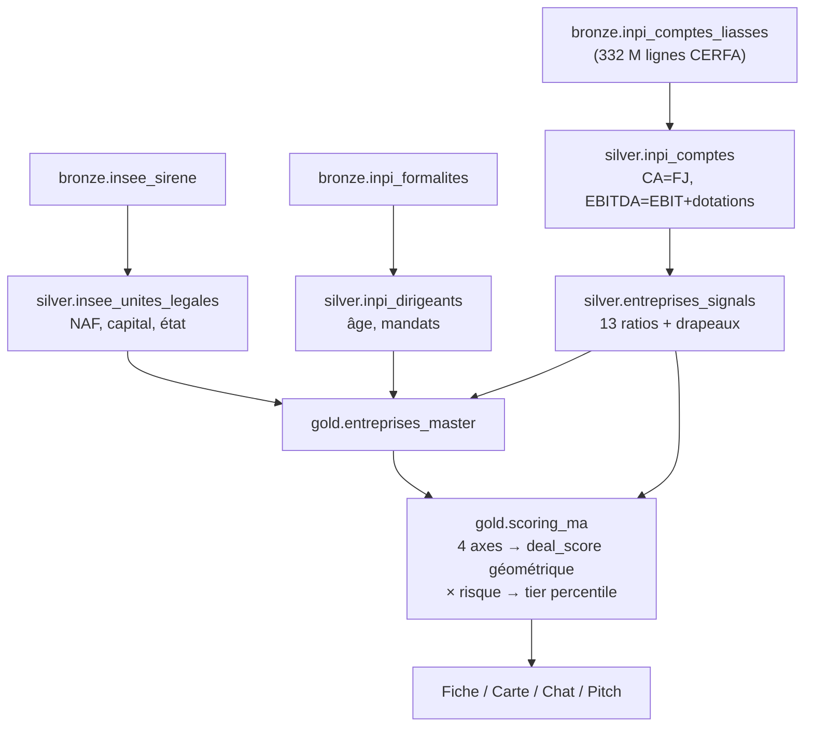
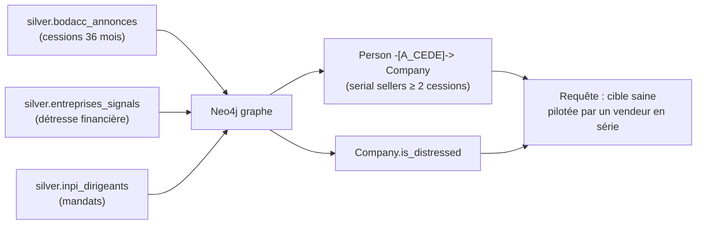

# Origin — Cartographie de la donnée

> Plan complet du datalake : **d'où vient la donnée**, **comment elle est transformée**
> (sources → bronze → silver → gold), et **où elle est consommée** dans le produit.
> Architecture **médaillon** (bronze = brut, silver = nettoyé/normalisé, gold = agrégé/scoré).

Dernière mise à jour : 2026-06-12.

---

## 1. Vue d'ensemble — flux de la donnée

```mermaid
flowchart LR
  subgraph SRC["SOURCES OFFICIELLES"]
    direction TB
    S1["INPI RNE<br/>+ Comptes"]
    S2["INSEE / SIRENE"]
    S3["BODACC (DILA)"]
    S4["DVF (DGFiP)"]
    S5["OpenSanctions / ICIJ"]
    S6["OSINT / Web"]
  end

  subgraph BRONZE["BRONZE — brut (~580 M lignes, 62 tables)"]
    direction TB
    B1["liasses, formalités,<br/>dépôts INPI"]
    B2["SIRENE raw"]
    B3["BODACC raw"]
    B4["DVF raw"]
    B5["sanctions, offshore raw"]
  end

  subgraph SILVER["SILVER — nettoyé/normalisé (~120 M lignes, 22 tables)"]
    direction TB
    SV1["inpi_comptes<br/>(bilans, CA=FJ)"]
    SV2["inpi_dirigeants<br/>dirigeants_360"]
    SV3["entreprises_signals<br/>(ratios)"]
    SV4["bodacc, sanctions,<br/>dvf, sci_master"]
  end

  subgraph GOLD["GOLD — agrégé / scoré (~28 M lignes, 12 tables)"]
    direction TB
    G1["entreprises_master"]
    G2["scoring_ma<br/>(deal score + axes)"]
    G3["dirigeants_master<br/>network_mandats"]
    G4["compliance_red_flags<br/>signaux_ma_feed"]
  end

  subgraph PROD["PRODUIT"]
    direction TB
    P1["Fiche entreprise"]
    P2["Cartes / Explorer"]
    P3["Chat copilot"]
    P4["Scoring & Pitch PDF"]
    P5["Killer feature<br/>(pré-cession, Neo4j)"]
  end

  SRC --> BRONZE --> SILVER --> GOLD --> PROD
```

**Principe** : aucune donnée n'est inventée. Chaque table gold est traçable jusqu'à une
source officielle via silver et bronze.

---

## 2. Volumétrie (chiffres clés)

| Couche | Rôle | Tables | Lignes (ordre de grandeur) |
|---|---|---|---|
| 🟫 **Bronze** | Copie brute des sources (rien jeté) | 62 | **~580 millions** |
| ⬜ **Silver** | Nettoyage, normalisation, jointures, ratios | 22 | **~120 millions** |
| 🟨 **Gold** | Agrégation, scoring, vues produit | 12 | **~28 millions** |

Cibles couvertes : **411 295 entreprises scorées**, **8,2 M dirigeants**, **6,3 M dépôts de comptes**, **15 M transactions immobilières**.

---

## 3. Inventaire — couche GOLD (ce que le produit consomme)

| Table | Lignes | Contenu | Source (silver) |
|---|---|---|---|
| **entreprises_master** | 411 295 | Référentiel cible : identité + financier consolidé | entreprises_signals, inpi_comptes |
| **scoring_ma** | 411 295 | Deal score + 4 axes + ratios + EV + tier | entreprises_master, entreprises_signals, liasses |
| **compliance_red_flags** | 411 295 | Risk score + drapeaux détresse/sanctions | entreprises_signals, sanctions, bodacc |
| **dirigeants_master** | 8 154 677 | Référentiel dirigeants + signaux | inpi_dirigeants, dirigeants_360 |
| **persons_master_universal** | 8 160 430 | Personnes unifiées (dirigeants + contacts) | inpi_dirigeants, osint |
| **persons_contacts_master** | 7 076 630 | Contacts enrichis | osint_persons, inpi |
| **signaux_ma_feed** | 2 206 310 | Flux de signaux M&A temps réel | bodacc, signals |
| **network_mandats** | 1 367 295 | Graphe co-mandats (réseau dirigeants) | inpi_dirigeants |
| **juridictions_master** | 239 301 | Décisions de justice unifiées | juridictions_unifiees |
| **parcelles_cibles** | 226 809 | Patrimoine immobilier (parcelles) | dvf, cadastre |
| **cibles_ma_top** | 82 260 | Top cibles pré-filtrées (page Intelligence) | entreprises_master |
| **benchmarks_sectoriels** | 947 | Médianes/multiples par secteur | scoring_ma agrégé |

---

## 4. Inventaire — couche SILVER (nettoyé / calculé)

| Table | Lignes | Contenu |
|---|---|---|
| insee_etablissements | 43,3 M | Établissements (SIRET) normalisés |
| insee_unites_legales | 29,6 M | Unités légales (SIREN) |
| dvf_transactions | 15,0 M | Transactions immobilières |
| inpi_dirigeants | 8,1 M | Dirigeants (mandats, rôles) |
| dirigeants_360 | 8,1 M | Vue 360° dirigeant (fallback fiche) |
| **inpi_comptes** | 6,27 M | **Bilans flat (CA=FJ, EBITDA, postes)** ← cœur financier |
| dirigeant_sci_patrimoine | 3,5 M | Liens dirigeant ↔ SCI |
| sci_master | 3,0 M | SCI patrimoniales (capital, valeur) |
| entreprises_relationships | 1,6 M | Liens capitalistiques inter-sociétés |
| crossref_hal_innovation | 713 k | Publications R&D (non branché) |
| hatvp_lobbying_persons | 435 k | Lobbyistes HATVP |
| **entreprises_signals** | 411 k | **Feature store : 13 ratios + drapeaux** ← cœur calcul |
| bodacc_annonces | 315 k | Annonces légales |
| sanctions / opensanctions | 303 k / 284 k | Sanctions consolidées |
| juridictions_unifiees | 239 k | Décisions de justice |
| gleif_lei | 20,8 k | Codes LEI (entités internationales) |
| icij_offshore_match | 19,2 k | Liens offshore matchés |
| judilibre_decisions | 15,0 k | Décisions Cour cassation/appel |
| transparence_sante_dirigeants | 11,5 k | Paiements pharma (non branché) |
| osint_companies_enriched | 11,4 k | Présence web (domaine, score digital) |
| osint_persons_enriched | 2,0 k | Profils sociaux dirigeants |

---

## 5. Inventaire — couche BRONZE (sources brutes, top 25)

| Table | Lignes | Source |
|---|---|---|
| inpi_comptes_liasses | **331,9 M** | INPI — lignes de liasse fiscale (codes CERFA) |
| inpi_formalites_activites | 47,4 M | INPI RNE |
| insee_sirene_siret_raw | 43,3 M | INSEE |
| inpi_formalites_etablissements | 38,9 M | INPI RNE |
| bodacc_annonces_raw | 30,3 M | DILA |
| inpi_formalites_entreprises | 27,3 M | INPI RNE |
| dvf_transactions_raw | 15,0 M | DGFiP |
| inpi_formalites_personnes | 15,0 M | INPI RNE |
| inpi_comptes_identite / depots | 6,3 M / 6,2 M | INPI |
| icij_offshore_raw | 1,6 M | ICIJ |
| rna_associations_raw | 620 k | RNA (associations) |
| opensanctions_entities_raw | 496 k | OpenSanctions |
| hatvp_representants_raw | 459 k | HATVP |
| legifrance / jorf_textes | 344 k / 306 k | Légifrance / JO |
| judilibre_decisions_raw | 264 k | Cour de cassation |
| inpi_marques_raw | 116 k | INPI marques |
| gleif_lei_raw | 20,8 k | GLEIF |
| decp_marches_raw / boamp | 18 k / 22 k | Marchés publics |
| basias_sites_raw | 12,5 k | Sites pollués (BASIAS) |
| transparence_sante_raw | 11,5 k | Transparence Santé |
| osint_companies / persons | 11,4 k / 2 k | Scan web |

*(+ ~35 autres sources : douanes, URSSAF, ADEME/GES, brevets, presse, world_bank, kali CCN…)*

---

## 6. Lignée — comment se construit un **Deal Score**

**Exemple Roederer** : liasse → CA 188 M€ (FJ) + EBITDA 78,7 M€ → marge 41,8 %, ratios →
axes (Transmission 100 / Attractivity 85 / Scale 100 / Structure 90) → deal_score **91**, tier **A_HOT**.

---

## 7. Lignée — Killer feature « alertes pré-cession » (Neo4j)

193 vendeurs en série identifiés · 411 k sociétés flaggées santé financière · 2 584 arêtes de cession.

---

## 8. Surfaces produit → tables consommées

| Surface | Tables gold lues |
|---|---|
| **Fiche entreprise** | entreprises_master, scoring_ma, compliance_red_flags, dirigeants_master, signaux_ma_feed, parcelles_cibles |
| **Cartes / Explorer** | entreprises_master + scoring_ma (axes, ratios, EBITDA) + inpi_comptes (historique CA) |
| **Chat copilot** | scoring_ma (sélection avancée), dirigeants_master, network_mandats, sanctions |
| **Pitch PDF** | scoring_ma + fiche (mêmes données) |
| **Killer feature** | Neo4j (dérivé de bodacc + signals + dirigeants) |

---

## 9. Périmètre & gouvernance

- **Sources** : 100 % publiques/officielles françaises (cf. `METHODOLOGIE_DONNEES.md`).
- **Donnée de référence partagée** (datalake) vs **donnée utilisateur** (watchlists, pipeline — à isoler par tenant en SaaS).
- **Rafraîchissement** : silver via scheduler (REFRESH) ; rebuilds gold à la demande ; cascade complète pour changement de définition (ex. fix CA).
- **Traçabilité** : chaque table gold → silver → bronze → source nommée. Distinction systématique 🟢 sourcé / 🟡 calculé / 🟠 estimé.

---

*Origin — cartographie générée depuis l'état réel du datalake (pg_stat_user_tables, 2026-06-12).*
