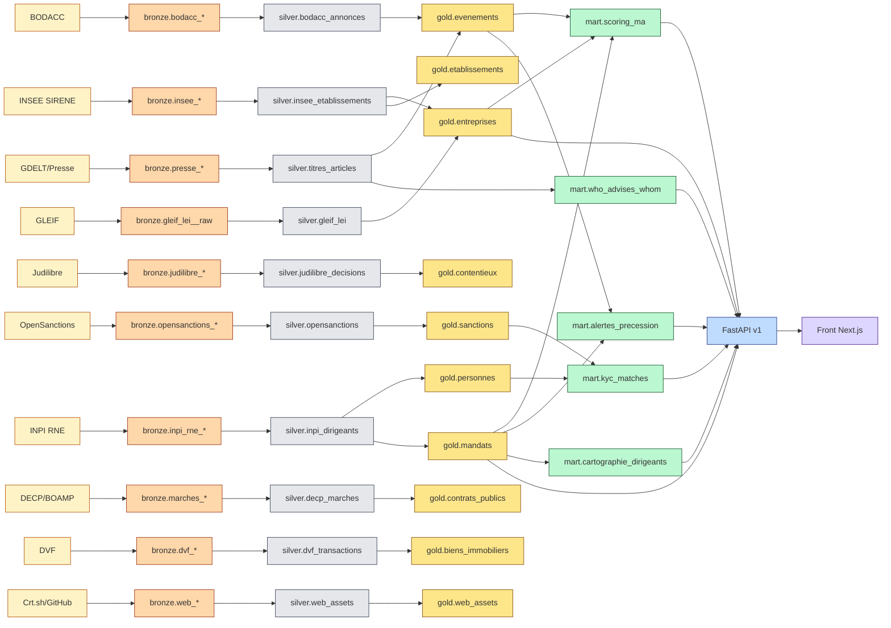

# DATA CATALOG & LINEAGE — DEMOEMA

> **Catalogue exhaustif** des objets data de l'application : sources, tables, marts, API, front. Lineage end-to-end source → produit.
>
> 🎨 **Diagrammes de lineage Mermaid détaillés** : voir [`DATACATALOG_LINEAGE.md`](./DATACATALOG_LINEAGE.md) — 8 diagrammes par cas d'usage produit (Targets / Signaux / Compliance / Graphe / Contacts) + lineage global par couche fonctionnelle.
>
> 🏗️ **Diagrammes architecture** (medallion, codegen, OSINT, infra VPS) : voir [`ARCHITECTURE_DIAGRAMS.md`](./ARCHITECTURE_DIAGRAMS.md).
>
> Pour les chiffres financiers : `FINANCES_UNIFIE.md` · Pour l'architecture infra : `ARCHITECTURE_TECHNIQUE.md` · Pour la liste sources : `ARCHITECTURE_DATA_V2.md`.

---

## 1. Architecture en couches (Medallion)

```
┌─────────────────────────────────────────────────────────────────────┐
│  COUCHE 0 — SOURCES EXTERNES (140 sources actives sur 143)          │
│  APIs gouv (INSEE, INPI, BODACC, Judilibre, etc.) + RSS + Bulk      │
└─────────────────────┬───────────────────────────────────────────────┘
                      │  Ingestion (Dagster + httpx + DuckDB)
                      ▼
┌─────────────────────────────────────────────────────────────────────┐
│  COUCHE 1 — BRONZE (RAW)  S3 Parquet partitionné  Iceberg           │
│  Données brutes immuables, horodatées, schéma source-fidèle          │
│  Naming : bronze.{source}__{endpoint}__raw                          │
└─────────────────────┬───────────────────────────────────────────────┘
                      │  dbt-core (staging models)
                      ▼
┌─────────────────────────────────────────────────────────────────────┐
│  COUCHE 2 — SILVER (STAGING)  Postgres                              │
│  Normalisation : typage, dédup, snake_case, FK candidats             │
│  Naming : silver.{source}__{entité}                                 │
└─────────────────────┬───────────────────────────────────────────────┘
                      │  dbt-core (intermediate + golden record)
                      ▼
┌─────────────────────────────────────────────────────────────────────┐
│  COUCHE 3 — GOLD (CORE)  Postgres                                    │
│  Master tables : entité_id unique, golden record cross-sources       │
│  Naming : gold.{entité} (entreprises, personnes, etc.)              │
└─────────────────────┬───────────────────────────────────────────────┘
                      │  dbt-core (mart models) + Python ML
                      ▼
┌─────────────────────────────────────────────────────────────────────┐
│  COUCHE 4 — MARTS (USE CASES)  Postgres + pgvector                  │
│  Tables dénormalisées orientées feature produit                      │
│  Naming : mart.{feature} (scoring_ma, alertes_precession, etc.)    │
└─────────────────────┬───────────────────────────────────────────────┘
                      │  FastAPI + Redis cache
                      ▼
┌─────────────────────────────────────────────────────────────────────┐
│  COUCHE 5 — API (FastAPI)  REST endpoints + Auth Supabase           │
│  Naming : /api/v1/{ressource}                                       │
└─────────────────────┬───────────────────────────────────────────────┘
                      │
                      ▼
┌─────────────────────────────────────────────────────────────────────┐
│  COUCHE 6 — FRONT (Next.js)  Pages utilisateur                       │
│  Naming : /app/{route}                                               │
└─────────────────────────────────────────────────────────────────────┘
```

---

## 2. COUCHE 0 — Sources externes (résumé)

> Catalog complet : `ARCHITECTURE_DATA_V2.md`. Ici résumé synthétique pour le lineage.

| ID source | Nom | Type | Refresh | Volume | Couche fonctionnelle |
|---|---|---|---|---|---|
| S001 | INSEE SIRENE Stock | Bulk Parquet | Mensuel | 31M étab | 1. Identification |
| S002 | INSEE SIRENE API | REST OAuth2 | Quotidien (deltas) | 31M étab | 1. Identification |
| S003 | API Recherche Entreprises | REST | Temps réel | 5M | 1. Identification |
| S004 | INPI RNE | REST OAuth2 | Quotidien | 15M dirigeants | 1. Identification + 7. Ownership |
| S005 | INPI Comptes annuels | REST + PDF | Annuel | 1.5M dépôts | 3. Finances |
| S007 | RNA (associations) | Bulk | Mensuel | 1.5M | 1. Identification |
| S009 | GLEIF | REST | Hebdo | 80-100K LEI FR | 2. ID intl |
| S010 | OpenCorporates | REST + Bulk | Mensuel | 200M monde | 2. ID intl |
| S011 | Wikidata SPARQL | SPARQL | Hebdo | ~50K entités FR | 2. ID intl |
| S012 | OpenSanctions | REST + Bulk | Quotidien | 200K sanctions | 12. Compliance |
| S016 | INPI Comptes annuels (XBRL) | Parsing PDF | Annuel | 1.5M | 3. Finances |
| S017 | ESANE INSEE | Bulk | Annuel | Bench sectoriels | 3. Finances |
| S030 | BODACC | REST + Webhook | Temps réel | 48M annonces | 5. Publications légales |
| S034 | Judilibre | REST | Quotidien | 5M décisions | 6. Contentieux |
| S035 | Légifrance | REST | Quotidien | JORF | 6. Juridique |
| S036 | CNIL sanctions | Scraping HTML | Hebdo | <1k | 6. Juridique |
| S041 | INPI RBE | ❌ FERMÉ CJUE 22/11/2022 | — | — | (retiré) |
| S046 | BOAMP | REST | Quotidien | Appels d'offres | 8. Marchés publics |
| S047 | DECP | Bulk OpenData | Hebdo | Attributions FR | 8. Marchés publics |
| S051 | INPI Brevets | REST | Mensuel | 5M brevets FR | 9. PI/R&D |
| S063 | France Travail | REST | Quotidien | Offres emploi | 10. RH |
| S070 | DVF | Bulk OpenData | Mensuel | 30M transac immo | 11. Immobilier |
| S077 | Gels des Avoirs DGTrésor | XML | Quotidien | Sanctions FR | 12. Compliance |
| S084 | ADEME Bilans GES | REST | Annuel | ~5K bilans | 13. ESG |
| S095 | HATVP | Bulk | Mensuel | 3215 lobbyistes | 14. Lobbying |
| S099 | FEDER bénéficiaires | Bulk | Annuel | Aides UE | 15. Subventions |
| S106 | Certificate Transparency (crt.sh) | REST | Temps réel | M/jour | 16. Web/Digital |
| S111 | GitHub API | REST | Quotidien | Repos | 16. Web/Digital |
| S118 | GDELT 2.0 | Bulk 15min | Temps réel | 10M evt/jour | 17. Presse/Sentiment |
| S120 | Les Échos RSS | RSS | Temps réel (titre+URL+date uniq.) | flux continu | 17. Presse |
| S123 | CFNews RSS | RSS | Temps réel (titre+URL+date uniq.) | flux continu | 17. Presse |
| S125 | ❌ Trustpilot | RETIRÉ — CGU | — | — | — |
| S126 | ❌ Google Reviews | RETIRÉ — CGU | — | — | — |

> **Total** : 140 sources actives sur 143 cataloguées (3 retirées). Cf. `ARCHITECTURE_DATA_V2.md`.

---

## 3. COUCHE 1 — BRONZE (Raw zone S3)

### Convention

- **Format** : Parquet partitionné `s3://demoema-raw/{source_id}/year={YYYY}/month={MM}/day={DD}/`
- **Schema** : strict identique à la source (pas de transformation)
- **Naming** : `bronze.{source_id}__{endpoint}__raw`
- **Rétention** : illimitée (compliance + replay)
- **Compression** : ZSTD

### Tables Bronze prioritaires Y1 (20 sources)

| Table Bronze | Source | Endpoint | Volume | Fréquence ingestion |
|---|---|---|---|---|
| `bronze.insee_sirene_stock_etablissements__raw` | S001 | bulk Parquet | 31M lignes/mois | Mensuel |
| `bronze.insee_sirene_api_etablissements__raw` | S002 | /siret | deltas | Quotidien |
| `bronze.insee_sirene_api_unites_legales__raw` | S002 | /siren | deltas | Quotidien |
| `bronze.recherche_entreprises__raw` | S003 | /search | enrichissement à la demande | Temps réel cache 24h |
| `bronze.inpi_rne_dirigeants__raw` | S004 | /representants | 15M dirigeants | Quotidien |
| `bronze.inpi_rne_be__raw` | S004 | /beneficiaires-effectifs | partiel (CJUE) | Quotidien |
| `bronze.inpi_comptes_annuels__raw` | S005 | /comptes + PDF | 1.5M dépôts/an | Annuel + à la demande |
| `bronze.bodacc_annonces__raw` | S030 | /annonces | 48M | Quotidien (delta) + webhook |
| `bronze.judilibre_decisions__raw` | S034 | /decisions | 5M décisions | Quotidien |
| `bronze.opensanctions_entities__raw` | S012 | /entities | 200K | Quotidien |
| `bronze.gels_avoirs__raw` | S077 | XML | <10K | Quotidien |
| `bronze.gleif_lei__raw` | S009 | /lei-records | 80-100K FR | Hebdo |
| `bronze.opencorporates_companies__raw` | S010 | /companies | bulk FR + monde | Mensuel |
| `bronze.decp_attributions__raw` | S047 | bulk | 1M+/an | Hebdo |
| `bronze.boamp_avis__raw` | S046 | /avis | 100K+/an | Quotidien |
| `bronze.france_travail_offres__raw` | S063 | /offres | flux | Quotidien |
| `bronze.dvf_transactions__raw` | S070 | bulk | 30M depuis 2014 | Mensuel |
| `bronze.crt_sh_subdomains__raw` | S106 | /search | continu | Temps réel filtrée |
| `bronze.github_orgs__raw` | S111 | /orgs + /users | ciblé | Quotidien |
| `bronze.gdelt_events__raw` | S118 | bulk 15min | 10M/jour (filtré FR) | Temps réel |
| `bronze.wikidata_entities__raw` | S011 | SPARQL | ~50K FR | Hebdo |

---

## 4. COUCHE 2 — SILVER (Staging Postgres)

### Convention

- **DBMS** : Postgres 16 (managed Scaleway)
- **Schéma** : `silver`
- **Models dbt** : `models/silver/{source}.sql`
- **Tests dbt** : not_null sur PK, unique, accepted_values, foreign_key
- **Refresh** : selon fréquence source (sync via Dagster sensors)

### Tables Silver principales

| Table | Source de tirage | Colonnes clés | Volume |
|---|---|---|---|
| `silver.insee_etablissements` | bronze.insee_sirene_stock + bronze.insee_sirene_api_etablissements | siret, siren, naf, dénomination, adresse, geo, effectif_tranche, date_creation, etat | 31M |
| `silver.insee_unites_legales` | bronze.insee_sirene_api_unites_legales | siren, denomination_unite, naf, date_creation, etat, categorie | 5M |
| `silver.inpi_dirigeants` | bronze.inpi_rne_dirigeants | siren, role_code, role_lib, qualité, prenom, nom, date_naissance_année (RGPD), date_debut, date_fin | 15M mandats |
| `silver.inpi_comptes` | bronze.inpi_comptes_annuels | siren, exercice_debut, exercice_fin, ca, marge_brute, ebitda, total_bilan, capitaux_propres, dette_nette, source_url | ~1.5M dépôts/an |
| `silver.bodacc_annonces` | bronze.bodacc_annonces | siren, type_annonce (création, modif, vente, dissolution, procedure), date_publication, departement, ville, payload_jsonb | 48M+ |
| `silver.judilibre_decisions` | bronze.judilibre_decisions | id, juridiction, date, defenseur_siren, demandeur_siren, theme, montant_si_chiffré, url | 5M |
| `silver.opensanctions` | bronze.opensanctions_entities | id, name, types[], countries[], birth_date, programs[], source_list | 200K |
| `silver.gels_avoirs` | bronze.gels_avoirs | identifiant_un, nom, qualite, programme, date_inscription | <10K |
| `silver.gleif_lei` | bronze.gleif_lei | lei, legal_name, country, parent_lei, ultimate_parent_lei, status | 80K FR |
| `silver.opencorporates_fr` | bronze.opencorporates_companies | jurisdiction_code, company_number, name, status, source | 5M FR |
| `silver.decp_marches` | bronze.decp_attributions | id, acheteur_siret, titulaire_siret, montant_ht, date_notification, objet, lieu | 1M/an |
| `silver.boamp_avis` | bronze.boamp_avis | id, acheteur, objet, montant_estime, date_publication, date_limite, lieu, cpv | 100K/an |
| `silver.france_travail_offres` | bronze.france_travail_offres | id_offre, entreprise_siret, intitule, type_contrat, lieu, salaire, date_creation | flux |
| `silver.dvf_transactions` | bronze.dvf_transactions | id_mutation, date_mutation, valeur_fonciere, code_postal, surface_terrain, surface_bati, type_local, code_commune, geo | 30M depuis 2014 |
| `silver.crt_sh_certificates` | bronze.crt_sh_subdomains | domain, subdomain, issuer, valid_from, valid_to | flux |
| `silver.github_orgs` | bronze.github_orgs | login, name, public_repos, followers, blog, location | ciblé |
| `silver.gdelt_events_fr` | bronze.gdelt_events | event_id, day, actor1_name, actor2_name, event_code (CAMEO), source_url, organization_mentions | 10M filtré FR |
| `silver.wikidata_entreprises` | bronze.wikidata_entities | qid, label, isin, lei, siren, founders, ceo, headquarters | 50K |

---

## 5. COUCHE 3 — GOLD (Core master tables)

### Convention

- **Schéma** : `gold`
- **Entité-clé** : `entity_id` UUID interne unique cross-sources
- **Golden record** : règles de priorité par champ documentées
- **Refresh** : journalier (delta) + recalcul mensuel complet
- **Indexes** : clés primaires + index trgm (search) + GiST (géo) + B-tree (filtre courant)

### 5.1 Tables Master

#### `gold.entreprises` — 5M lignes (FR), 25M (UE Y3+)

```sql
CREATE TABLE gold.entreprises (
  -- Identifiants
  entity_id        UUID PRIMARY KEY,
  siren            CHAR(9) UNIQUE NOT NULL,
  lei              VARCHAR(20),                -- depuis silver.gleif_lei
  opencorp_id      VARCHAR,                    -- depuis silver.opencorporates_fr
  wikidata_qid     VARCHAR,                    -- depuis silver.wikidata_entreprises
  edgar_cik        VARCHAR,                    -- pour filiales US (Y3+)
  ch_uk_id         VARCHAR,                    -- Companies House UK (Y3+)
  isin             VARCHAR(12),                -- pour cotées

  -- Identité (golden record)
  denomination     VARCHAR NOT NULL,           -- INSEE prioritaire, fallback OpenCorporates
  sigle            VARCHAR,
  nom_commercial   VARCHAR,
  date_creation    DATE,
  forme_juridique  VARCHAR,                    -- INSEE codes 1-9
  forme_juridique_lib VARCHAR,

  -- Classification
  naf              CHAR(5),                    -- INSEE
  naf_libelle      VARCHAR,
  nace             CHAR(6),                    -- mapping NAF↔NACE Eurostat
  categorie_entreprise VARCHAR,                -- TPE/PME/ETI/GE (INSEE)

  -- Localisation siège (BAN normalisée)
  siege_siret      CHAR(14),
  siege_adresse    JSONB,                      -- structuré BAN
  siege_commune    VARCHAR,
  siege_dept       CHAR(3),
  siege_region     VARCHAR,
  siege_geo        GEOMETRY(POINT, 4326),

  -- Taille (snapshots datés)
  effectif_tranche VARCHAR,                    -- INSEE (00, 01, 02, ...)
  effectif_exact   INT,                        -- INPI comptes si dispo
  ca_dernier       NUMERIC,                    -- INPI comptes
  ca_n_minus_1     NUMERIC,
  ebitda_dernier   NUMERIC,
  total_bilan      NUMERIC,
  capitaux_propres NUMERIC,
  date_derniers_comptes DATE,

  -- Statut
  statut           VARCHAR CHECK (statut IN ('actif','cesse','procedure','radie')),
  date_statut      DATE,

  -- Scoring (alimenté par mart.scoring_ma)
  score_ma         INT CHECK (score_ma BETWEEN 0 AND 100),
  score_defaillance INT CHECK (score_defaillance BETWEEN 0 AND 100),
  score_trajectoire INT,                      -- killer feature : trajectoire prédictive

  -- Métadonnées
  derniere_maj     TIMESTAMPTZ DEFAULT now(),
  sources_de_verite JSONB                      -- {"denomination": "INSEE", "ca": "INPI", ...}
);

CREATE INDEX idx_entreprises_siren ON gold.entreprises(siren);
CREATE INDEX idx_entreprises_naf ON gold.entreprises(naf);
CREATE INDEX idx_entreprises_dept ON gold.entreprises(siege_dept);
CREATE INDEX idx_entreprises_statut ON gold.entreprises(statut);
CREATE INDEX idx_entreprises_score_ma ON gold.entreprises(score_ma DESC);
CREATE INDEX idx_entreprises_denomination_trgm ON gold.entreprises USING gin (denomination gin_trgm_ops);
CREATE INDEX idx_entreprises_geo ON gold.entreprises USING gist (siege_geo);
```

**Lineage** : `silver.insee_etablissements` + `silver.insee_unites_legales` + `silver.inpi_comptes` + `silver.gleif_lei` + `silver.opencorporates_fr` + `silver.wikidata_entreprises`

#### `gold.etablissements` — 31M lignes

Tous les SIRET (un siège + N secondaires par SIREN). Lineage : `silver.insee_etablissements`.

#### `gold.personnes` — ~15M lignes

```sql
CREATE TABLE gold.personnes (
  person_id        UUID PRIMARY KEY,
  -- Identité (RGPD : minimum nécessaire)
  prenom           VARCHAR,
  nom              VARCHAR,
  date_naissance_annee INT,                   -- RGPD : année uniquement
  -- Pas d'email, pas de téléphone, pas d'adresse perso
  wikidata_qid     VARCHAR,                    -- pour notabilité publique
  -- Métadonnées
  derniere_maj     TIMESTAMPTZ DEFAULT now(),
  sources          TEXT[]
);
```

**Lineage** : `silver.inpi_dirigeants` (déduplication par prénom+nom+année naissance)

#### `gold.mandats` — ~50M jonctions personne↔entreprise

```sql
CREATE TABLE gold.mandats (
  mandat_id        UUID PRIMARY KEY,
  person_id        UUID REFERENCES gold.personnes(person_id),
  entity_id        UUID REFERENCES gold.entreprises(entity_id),
  role_code        VARCHAR,                    -- code INPI (ex 31 président, 51 DG, 70 administrateur)
  role_libelle     VARCHAR,
  date_debut       DATE,
  date_fin         DATE,                       -- NULL si actif
  source           VARCHAR DEFAULT 'INPI_RNE'
);

CREATE INDEX idx_mandats_person ON gold.mandats(person_id);
CREATE INDEX idx_mandats_entity ON gold.mandats(entity_id);
CREATE INDEX idx_mandats_actif ON gold.mandats(entity_id) WHERE date_fin IS NULL;
```

**Lineage** : `silver.inpi_dirigeants` (transformations dates + mapping codes rôles)

#### `gold.evenements` — ~200M lignes

Table dénormalisée d'événements horodatés. Source des **alertes pré-cession**.

```sql
CREATE TABLE gold.evenements (
  evenement_id     UUID PRIMARY KEY,
  entity_id        UUID REFERENCES gold.entreprises(entity_id),
  date_evenement   DATE NOT NULL,
  type_evenement   VARCHAR NOT NULL,           -- 'creation','modification','procedure','dirigeant','presse','jurisprudence', etc.
  sous_type        VARCHAR,                    -- ex 'mandat_change', 'cfo_nomination', 'liquidation_judiciaire'
  source_id        VARCHAR,                    -- S001, S004, S030, etc.
  source_table     VARCHAR,                    -- silver.bodacc_annonces, etc.
  source_url       VARCHAR,
  payload          JSONB,                      -- détails source-fidèle
  pertinence_ma    INT                         -- 0-100, score "intérêt M&A"
);

CREATE INDEX idx_evenements_entity_date ON gold.evenements(entity_id, date_evenement DESC);
CREATE INDEX idx_evenements_type ON gold.evenements(type_evenement, sous_type);
CREATE INDEX idx_evenements_pertinence ON gold.evenements(pertinence_ma DESC) WHERE pertinence_ma > 50;
```

**Lineage** : `silver.bodacc_annonces` + `silver.judilibre_decisions` + `silver.gdelt_events_fr` + extraction NLP presse

#### Autres tables Gold

| Table | Volume | Lineage principal |
|---|---|---|
| `gold.brevets` | 5M | silver.inpi_brevets + silver.epo_ops (Y2) |
| `gold.marques` | 2M | silver.inpi_marques + silver.euipo_tmview (Y2) |
| `gold.publications` | 10M | silver.hal + silver.openalex (Y2) |
| `gold.contrats_publics` | 10M | silver.decp_marches + silver.boamp_avis |
| `gold.sanctions` | 500K | silver.opensanctions + silver.gels_avoirs |
| `gold.contentieux` | 5M | silver.judilibre_decisions |
| `gold.biens_immobiliers` | 30M | silver.dvf_transactions |
| `gold.web_assets` | 10M | silver.crt_sh_certificates + silver.github_orgs (Y2) |
| `gold.liens_graphe` | ~100M | dérivé de mandats croisés + actionnariat |
| `gold.embeddings` | 5M | pgvector — descriptions entreprises (Y2) |

---

## 6. COUCHE 4 — MARTS (Use cases produit)

### 6.1 `mart.scoring_ma` — Scoring M&A propriétaire

> Version V0 Q3 2026 : 30-50 features rule-based + LightGBM. V2 Q2 2027 : 100+ features.

```sql
CREATE TABLE mart.scoring_ma (
  entity_id        UUID PRIMARY KEY REFERENCES gold.entreprises,
  score_global     INT,                        -- 0-100
  -- 12 dimensions (cf. SIGNAUX_MA.md)
  score_maturite_dirigeant      INT,           -- 0-20
  score_signaux_patrimoniaux    INT,           -- 0-20
  score_dynamique_financiere    INT,           -- 0-15
  score_rh_gouvernance          INT,           -- 0-12
  score_consolidation_sectorielle INT,         -- 0-10
  score_juridique_reglementaire INT,           -- 0-8
  score_presse_media            INT,           -- 0-8
  score_innovation_pi           INT,           -- 0-6
  score_immobilier_actifs       INT,           -- 0-5
  score_esg_conformite          INT,           -- 0-5
  score_international           INT,           -- 0-5
  score_marches_publics         INT,           -- 0-4
  -- Détails
  features_json    JSONB,                      -- 50+ features individuelles
  multiplicateur   NUMERIC,                    -- composite signals (×1.3 à ×1.5)
  classification   VARCHAR,                    -- 'action_prioritaire', 'qualification', 'monitoring', 'veille'
  derniere_maj     TIMESTAMPTZ DEFAULT now()
);

CREATE INDEX idx_scoring_global ON mart.scoring_ma(score_global DESC);
CREATE INDEX idx_scoring_classif ON mart.scoring_ma(classification);
```

**Lineage** : `gold.entreprises` + `gold.mandats` + `gold.evenements` + `gold.contentieux` + `gold.brevets` + features dérivées

### 6.2 ⭐ `mart.alertes_precession` — Killer feature #1 (Q3 2026)

> Détection rule-based des signaux pré-cession sur BODACC + INPI RNE. Effort : 3-4 sem dev (sources déjà ingérées).

```sql
CREATE TABLE mart.alertes_precession (
  alerte_id        UUID PRIMARY KEY,
  entity_id        UUID REFERENCES gold.entreprises,
  type_signal      VARCHAR NOT NULL,           -- voir liste ci-dessous
  date_detection   TIMESTAMPTZ DEFAULT now(),
  date_evenement   DATE,
  evenement_id     UUID REFERENCES gold.evenements(evenement_id),
  confidence       NUMERIC CHECK (confidence BETWEEN 0 AND 1),
  details          JSONB,
  source_url       VARCHAR,
  notifiee         BOOLEAN DEFAULT FALSE,
  notification_at  TIMESTAMPTZ
);

CREATE INDEX idx_alertes_entity_date ON mart.alertes_precession(entity_id, date_detection DESC);
CREATE INDEX idx_alertes_type ON mart.alertes_precession(type_signal);
CREATE INDEX idx_alertes_non_notif ON mart.alertes_precession(notification_at) WHERE notifiee = FALSE;
```

**Types de signaux V1** (rules dbt + Python) :
| type_signal | Règle | Source |
|---|---|---|
| `mandat_change_critique` | Changement président/DG sur entreprise CA >2M€ | `gold.mandats` + `gold.evenements` BODACC |
| `cfo_nomination_55plus_no_succ` | Nomination CFO externe + dirigeant 55+ sans successeur | `gold.mandats` + `gold.personnes` |
| `delegation_pouvoir_ag` | Nouvelle délégation AG (signal préparation cession) | `gold.evenements` BODACC modif |
| `dirigeant_vers_pe` | Dirigeant rejoint un fonds PE après mandat | `gold.mandats` cross-référence avec liste PE FR |
| `holding_creation_pre_vente` | Création holding par dirigeant <12 mois avant vente | `gold.evenements` + `gold.mandats` |
| `procedure_collective_delta` | Démarrage procédure collective | `gold.evenements` BODACC procedure |

**KPI cible Q3 2026** : >20 signaux/semaine remontés sur 10 plus gros secteurs.

### 6.3 ⭐ `mart.who_advises_whom` — Killer feature #2 (Q4 2026)

> Base historique M&A advisors 2020-2026. **Stratégie sources V1 corrigée post-audit V3 (Q152)** : extraction depuis **sites web boutiques M&A** (publication volontaire = légal) + AMF + Wikidata, pas depuis presse (droits voisins).
>
> **Sources V1** : couche 17bis (Cambon, Oddo BHF, Natixis Partners, Rothschild, Lazard, Linklaters, BDO, Mazars, EY-P, DC Advisory, Edmond de Rothschild, Messier Maris) + AMF BDIF/GECO + Wikipedia/Wikidata.
> **Sources V2 (Y2 2027)** : partenariat CFNews négocié OU licence ADPI/CFC.

```sql
CREATE TABLE mart.deals_ma (
  deal_id          UUID PRIMARY KEY,
  date_annonce     DATE,
  date_closing     DATE,
  cible_entity_id  UUID REFERENCES gold.entreprises,
  acquereur_entity_id UUID REFERENCES gold.entreprises,
  montant_eur      NUMERIC,                    -- NULL si non publié
  type_deal        VARCHAR,                    -- 'acquisition','LBO','build-up','spin-off','IPO',...
  secteur          VARCHAR,
  source_url       VARCHAR,
  source           VARCHAR,                    -- 'cfnews','les_echos','la_tribune','amf'
  confiance_extraction NUMERIC,                -- 0-1 (NLP)
  validated_humain BOOLEAN DEFAULT FALSE
);

CREATE TABLE mart.deal_advisors (
  deal_advisor_id  UUID PRIMARY KEY,
  deal_id          UUID REFERENCES mart.deals_ma,
  advisor_entity_id UUID REFERENCES gold.entreprises,
  cote             VARCHAR CHECK (cote IN ('vendeur','acheteur')),
  role             VARCHAR,                    -- 'M&A','juridique','due_diligence','financement'
  source_text      TEXT
);

CREATE INDEX idx_deals_date ON mart.deals_ma(date_annonce DESC);
CREATE INDEX idx_deals_cible ON mart.deals_ma(cible_entity_id);
CREATE INDEX idx_deals_acq ON mart.deals_ma(acquereur_entity_id);
CREATE INDEX idx_deal_adv_entity ON mart.deal_advisors(advisor_entity_id);
```

**Lineage V1 (Q4 2026)** : `bronze.sites_boutiques_ma__raw` (couche 17bis : 12 sites scrappés Playwright) + `silver.amf_bdif` + `silver.amf_geco` + `silver.wikidata_entreprises` → **CamemBERT fine-tuné** (500 pages "Our deals" labellisées + Mistral 7B via API en backup pour extraction structurée) → validation humaine queue Notion si confiance < 0.75 → `mart.deals_ma` + `mart.deal_advisors`

**Lineage V2 (Y2 2027)** : ajout source presse via partenariat CFNews négocié OU licence ADPI/CFC.

**Cible V1 Q4 2026** : 3 000-5 000 deals FR historiques 2020-2026 (cohérent brochure "3 000+ deals indexés").

**Justification AI Act** : CamemBERT fine-tuné = modèle NLP classifieur/extracteur **non GPAI** (ne tombe pas sous art. 53). Le statut "déployeur" est préservé. Cf. `AI_ACT_COMPLIANCE.md`.

### 6.4 `mart.cartographie_dirigeants` — Graphe relationnel (Q3-Q4 2026)

> Vue dénormalisée pour visualisation force-graph. Pas Neo4j Y1 (cf. ARCHITECTURE_TECHNIQUE.md).

```sql
CREATE TABLE mart.graphe_noeuds (
  node_id          UUID PRIMARY KEY,
  node_type        VARCHAR,                    -- 'personne' ou 'entreprise'
  ref_id           UUID,                       -- person_id ou entity_id
  label            VARCHAR,
  poids            NUMERIC                     -- centralité, degré
);

CREATE TABLE mart.graphe_aretes (
  arete_id         UUID PRIMARY KEY,
  node_source      UUID REFERENCES mart.graphe_noeuds,
  node_target      UUID REFERENCES mart.graphe_noeuds,
  type_relation    VARCHAR,                    -- 'mandat','holding','siege_commun','co_publi','client_fournisseur_public','co_brevet'
  poids            NUMERIC,
  date_debut       DATE,
  date_fin         DATE
);

CREATE INDEX idx_aretes_source ON mart.graphe_aretes(node_source);
CREATE INDEX idx_aretes_target ON mart.graphe_aretes(node_target);
```

**Lineage** : `gold.mandats` + `gold.entreprises` + `gold.contrats_publics` + `gold.brevets`

### 6.5 `mart.kyc_compliance` — Module compliance (Q4 2026)

```sql
CREATE TABLE mart.kyc_matches (
  match_id         UUID PRIMARY KEY,
  entity_id        UUID REFERENCES gold.entreprises,
  person_id        UUID REFERENCES gold.personnes,
  source_liste     VARCHAR,                    -- 'gels_avoirs','opensanctions','amf_listes_noires'
  niveau_match     VARCHAR,                    -- 'exact','probable','possible'
  details          JSONB,
  date_detection   TIMESTAMPTZ DEFAULT now()
);
```

**Lineage** : `gold.sanctions` × `gold.entreprises` / `gold.personnes` (matching probabiliste)

### 6.6 `mart.signaux_ma_dénormalisée` — Cache scoring rapide

Vue matérialisée pour dashboard scoring + recherche multi-critères.

---

## 7. COUCHE 5 — API (FastAPI)

### Convention

- **Base URL** : `https://api.demoema.fr/v1` (Y1) → `https://api.demoema.io/v2` (Y3)
- **Auth** : Supabase JWT Bearer (Y1) → Clerk SSO (Y2+)
- **Rate limit** : par plan (Free/Starter/Pro/Enterprise)
- **Cache** : Redis 24h sur fiches stables, 1h sur scores
- **Réponse** : JSON, OpenAPI 3 documenté

### Endpoints v1 (Q3 2026)

| Méthode | Path | Description | Sources data | Plan minimum |
|---|---|---|---|---|
| GET | `/v1/entreprises/search` | Recherche full-text + filtres | `gold.entreprises` | Free |
| GET | `/v1/entreprises/{siren}` | Fiche enrichie 360° | `gold.entreprises` + jointures | Free (5/mois) → Starter |
| GET | `/v1/entreprises/{siren}/dirigeants` | Dirigeants actuels + historique | `gold.mandats` × `gold.personnes` | Starter |
| GET | `/v1/entreprises/{siren}/etablissements` | Tous les SIRET | `gold.etablissements` | Starter |
| GET | `/v1/entreprises/{siren}/comptes` | Comptes annuels | `silver.inpi_comptes` | Starter |
| GET | `/v1/entreprises/{siren}/evenements` | Événements horodatés | `gold.evenements` | Starter |
| GET | `/v1/entreprises/{siren}/scoring` | Score M&A + détail 12 dim | `mart.scoring_ma` | Pro |
| GET | `/v1/entreprises/{siren}/graphe` | Graphe dirigeants 2 degrés | `mart.graphe_*` | Pro |
| GET | `/v1/entreprises/{siren}/kyc` | Vérif sanctions | `mart.kyc_matches` | Starter |
| GET | `/v1/alertes` | Mes alertes pré-cession actives | `mart.alertes_precession` | Pro |
| POST | `/v1/alertes/subscribe` | S'abonner à une cible/secteur | crée trigger | Pro |
| GET | `/v1/deals/search` | Who advises whom — recherche deals | `mart.deals_ma` + `mart.deal_advisors` | Pro |
| GET | `/v1/deals/advisors/{siren}` | Tous les deals où ce conseil intervient | `mart.deal_advisors` | Pro |
| POST | `/v1/rapports/cible` | Génère rapport "Cible" PDF (490€) | toutes les couches | Pay-per-report ou Starter+ |
| POST | `/v1/exports/excel` | Templates M&A (Teaser, Buyer list) | jointures multiples | Pro |

---

## 8. COUCHE 6 — FRONT (Next.js)

### Routes utilisateur

| Route | Description | API consommées |
|---|---|---|
| `/` | Landing page (acquisition) | — |
| `/recherche` | Recherche entreprise + filtres | `/v1/entreprises/search` |
| `/entreprise/[siren]` | Fiche entreprise enrichie | `/v1/entreprises/{siren}` + sous-endpoints |
| `/entreprise/[siren]/dirigeants` | Onglet dirigeants + graphe | `/v1/entreprises/{siren}/dirigeants` + `/graphe` |
| `/entreprise/[siren]/scoring` | Onglet scoring M&A 12 dim | `/v1/entreprises/{siren}/scoring` |
| `/entreprise/[siren]/evenements` | Timeline événements | `/v1/entreprises/{siren}/evenements` |
| `/alertes` | Dashboard alertes pré-cession | `/v1/alertes` |
| `/alertes/configurer` | Setup nouvelle alerte | `/v1/alertes/subscribe` |
| `/deals` | Who advises whom (recherche deals) | `/v1/deals/search` |
| `/deals/advisor/[siren]` | Profil advisor + ses deals | `/v1/deals/advisors/{siren}` |
| `/rapports` | Catalogue rapports payants | — |
| `/rapports/cible/[siren]` | Génération rapport (Stripe + PDF) | `/v1/rapports/cible` |
| `/exports` | Templates Excel M&A | `/v1/exports/excel` |
| `/dashboard` | Dashboard utilisateur (NPS, usage, billing) | API interne |

---

## 9. LINEAGE par feature (vue end-to-end)

### 9.1 Lineage : Fiche entreprise enrichie

```
[Sources] ─┬─→ S001 INSEE bulk ─┬─→ bronze.insee_sirene_stock ─┐
          │                     │                                │
          ├─→ S002 INSEE API ───┼─→ bronze.insee_sirene_api ─────┼─→ silver.insee_etablissements ─┐
          │                     │                                │                                  │
          ├─→ S004 INPI RNE ────┼─→ bronze.inpi_rne_dirigeants ──┼─→ silver.inpi_dirigeants ──────┤
          │                     │                                │                                  │
          ├─→ S005 INPI cptes ──┼─→ bronze.inpi_comptes_annuels ─┼─→ silver.inpi_comptes ─────────┤
          │                     │                                │                                  ▼
          ├─→ S009 GLEIF ───────┼─→ bronze.gleif_lei ────────────┼─→ silver.gleif_lei ──────→ gold.entreprises (golden record)
          │                     │                                │                                  │
          ├─→ S011 Wikidata ────┼─→ bronze.wikidata_entities ────┼─→ silver.wikidata_entreprises ─┘
          │                     │                                │
          └─→ S010 OpenCorp ────┴─→ bronze.opencorporates ───────┴─→ silver.opencorporates_fr ───┘
                                                                                                  │
                                                                                                  ▼
                                                                                  GET /v1/entreprises/{siren}
                                                                                                  │
                                                                                                  ▼
                                                                                  /entreprise/[siren] (Next.js)
```

### 9.2 ⭐ Lineage : Alertes pré-cession (Killer feature #1)

```
[Sources] ─┬─→ S030 BODACC (webhook + API)     ─→ bronze.bodacc_annonces       ─→ silver.bodacc_annonces ──┐
          │                                                                                                  │
          ├─→ S004 INPI RNE (delta quotidien)  ─→ bronze.inpi_rne_dirigeants   ─→ silver.inpi_dirigeants ──┤
          │                                                                                                  │
          └─→ Liste interne fonds PE FR        ─→ ref.fonds_pe (table fixe)                                  │
                                                                                                              │
                                                                  Génération événements typés (dbt)            │
                                                                  ───────────────────────────────────────      │
                                                                  gold.evenements                               │
                                                                  ───────────────────────────────────────      │
                                                                                                              │
                                                                  Règles métier (dbt + Python)                 │
                                                                  ───────────────────────────────────────      │
                                                                  • mandat_change_critique                     │
                                                                  • cfo_nomination_55plus_no_succ              │
                                                                  • delegation_pouvoir_ag                      │
                                                                  • dirigeant_vers_pe                          │
                                                                  • holding_creation_pre_vente                 │
                                                                  • procedure_collective_delta                 │
                                                                  ───────────────────────────────────────      │
                                                                                ▼                              │
                                                                  mart.alertes_precession ◄─────────────────────┘
                                                                                │
                                                          ┌─────────────────────┼─────────────────────┐
                                                          ▼                     ▼                     ▼
                                              GET /v1/alertes          POST /v1/alertes/subscribe   Email/Push notifications
                                                          │                                            (Sendgrid + webhook frontend)
                                                          ▼
                                              /alertes (dashboard utilisateur)
```

### 9.3 ⭐ Lineage : Who advises whom (Killer feature #2) — V1 corrigé post-audit V3

```
[Sources V1 Q4 2026]  ┬─→ ⭐ COUCHE 17bis (12 sites M&A) ──→ bronze.sites_boutiques_ma__raw
                       │   • Cambon, Oddo BHF, Natixis Partners                Playwright + Crawlee
                       │   • Rothschild, Lazard, Messier Maris                 (rate-limited, robots.txt OK)
                       │   • Linklaters, BDO, Mazars, EY-P, DC Advisory
                       │   • Edmond de Rothschild Corp Finance
                       │
                       ├─→ #22 AMF BDIF (cotées) ──→ silver.amf_bdif
                       ├─→ #23 AMF GECO (cotées) ──→ silver.amf_geco
                       └─→ #124 Wikipedia/Wikidata ──→ silver.wikidata_entreprises
                                                                                │
                       ⚠️ Sources presse #119-123 : EXCLUES V1                  │
                       (droits voisins → titre+URL+date insuffisant pour       │
                        extraction triplet `(cible, acquéreur, advisors)`)     │
                                                                                ▼
                                          NLP CamemBERT fine-tuné (500 pages "Our deals" labellisées)
                                          + Mistral 7B via API en backup extraction structurée
                                          ─────────────────────────────────────────────────────
                                          Tâches NLP :
                                          • Classification : page deal oui/non
                                          • NER : entreprises (SIREN matching), advisors, montants
                                          • Triplet extraction : (cible, acquéreur, advisors[])
                                          ─────────────────────────────────────────────────────
                                                        │
                                                        ▼
                                          Validation humaine (queue Notion) si confiance < 0.75
                                                        │
                                                        ▼
                                          mart.deals_ma  +  mart.deal_advisors
                                          (cible V1 : 3 000-5 000 deals FR 2020-2026)
                                                        │
                                                        ▼
                                          GET /v1/deals/search · GET /v1/deals/advisors/{siren}
                                                        │
                                                        ▼
                                          /deals · /deals/advisor/[siren]

[Sources V2 Y2 2027 — ajouts]
   - Partenariat CFNews négocié (10-30k€/an) → couvre presse spécialisée deals
   - OU licence ADPI/CFC (10-50k€/an) → couvre Les Échos / La Tribune / Usine Nouvelle
```

### 9.4 Lineage : Rapport "Cible" payant (490€)

```
GET /v1/rapports/cible (Stripe checkout) ──┐
                                            ▼
                                Compose rapport (Python + Jinja2 + WeasyPrint PDF)
                                ─────────────────────────────────────────────────
                                Sections :
                                1. Identité           ← gold.entreprises
                                2. Dirigeants         ← gold.mandats + gold.personnes
                                3. Comptes annuels    ← silver.inpi_comptes
                                4. Événements 24 mois ← gold.evenements
                                5. Scoring M&A 12 dim ← mart.scoring_ma
                                6. KYC compliance     ← mart.kyc_matches
                                7. Graphe dirigeants  ← mart.graphe_*
                                8. Alertes actives    ← mart.alertes_precession
                                9. Deals concurrents  ← mart.deals_ma (similar siren)
                                ─────────────────────────────────────────────────
                                              │
                                              ▼
                                Génération PDF (~10 pages)
                                              │
                                              ▼
                                Email PDF + lien S3 download
```

---

## 10. Métadonnées — Owner + Fraîcheur + Qualité

| Couche | Owner Y1 | Fréquence refresh | Tests dbt | SLA |
|---|---|---|---|---|
| Bronze | Lead Data Eng | selon source | Schema check seul | Best effort |
| Silver | Lead Data Eng | journalier | not_null PK, unique, FK candidats | <24h fraîcheur |
| Gold | Lead Data Eng + Backend | journalier | + accepted_values, business rules | <24h |
| Marts | Backend + ML Eng | selon use case (cf. ci-dessous) | tests métier | <1h pour alertes, <24h pour scoring |
| API | Backend | temps réel (cache 1-24h) | tests E2E | 99% disponibilité Y1 |
| Front | Frontend | live | Playwright E2E | 99% |

### Fréquences refresh par mart

| Mart | Refresh | Justification |
|---|---|---|
| `mart.scoring_ma` | Hebdo (full recalc) + journalier (deltas) | Scoring stable, batch nuit |
| `mart.alertes_precession` | Temps réel (webhook BODACC) + horaire (rules) | Alertes = valeur métier |
| `mart.who_advises_whom` | Quotidien (scrape presse + NLP) | Deals = fréquence press |
| `mart.cartographie_dirigeants` | Quotidien (deltas mandats) | Graphe stable |
| `mart.kyc_matches` | Quotidien (sanctions changent rapidement) | Compliance = critique |

---

## 11. Volumétries cibles

| Couche | Volume Y1 (5M FR) | Volume Y3 (25M UE) |
|---|---|---|
| Bronze (Parquet S3) | ~80 GB | ~400 GB |
| Silver (Postgres) | ~50 GB | ~250 GB |
| Gold (Postgres) | ~60 GB | ~300 GB |
| Marts (Postgres) | ~10 GB | ~50 GB |
| Embeddings (pgvector) | ~5 GB | ~30 GB |
| **Total infra** | **~205 GB** | **~1 TB** |

---

## 12. Conventions de nommage

| Élément | Convention | Exemple |
|---|---|---|
| Table Bronze | `bronze.{source_id}__{endpoint}__raw` | `bronze.insee_sirene_api_etablissements__raw` |
| Table Silver | `silver.{source}__{entité}` | `silver.insee_etablissements` |
| Table Gold | `gold.{entité}` | `gold.entreprises` |
| Mart | `mart.{feature}` | `mart.alertes_precession` |
| Vue dbt | `{layer}_{name}.sql` | `gold_entreprises.sql` |
| Test dbt | `assert_{table}_{condition}.sql` | `assert_entreprises_siren_unique.sql` |
| API endpoint | `/v{version}/{ressource}/{id}/{sous-ressource}` | `/v1/entreprises/123456789/dirigeants` |
| Front route | `/{ressource}/[id]` | `/entreprise/[siren]` |
| Colonne timestamp | `..._at` (UTC) | `created_at`, `updated_at` |
| Colonne date | `date_...` | `date_creation`, `date_mutation` |
| Colonne foreign key | `{table}_id` | `entity_id`, `person_id` |

---

## 13. Diagramme d'ensemble (lineage condensé)



---

## 14. Inventaire complet des objets data (par couche)

### Sources (141 actives sur 144 cataloguées V2.1)
Voir `ARCHITECTURE_DATA_V2.md` § 20 couches (avec nouvelle couche 17bis sites M&A pour Who advises whom).

### Bronze (initiales Y1 = 20 tables)
20 tables raw correspondant aux 20 sources prioritaires.

### Silver (Y1 = ~25 tables)
- 18 tables de normalisation source → silver
- 3 tables de référence : `ref.fonds_pe`, `ref.naf_libelles`, `ref.communes`
- 4 tables d'audit : `audit.dbt_runs`, `audit.api_calls`, `audit.users_activity`, `audit.alerts_sent`

### Gold (Y1 = 11 tables master)
1. `gold.entreprises` (5M)
2. `gold.etablissements` (31M)
3. `gold.personnes` (~15M)
4. `gold.mandats` (~50M)
5. `gold.evenements` (~200M)
6. `gold.brevets` (5M, Y1 partiel)
7. `gold.marques` (2M, Y2)
8. `gold.contrats_publics` (10M)
9. `gold.sanctions` (500K)
10. `gold.contentieux` (5M)
11. `gold.biens_immobiliers` (30M)

### Marts Y1 (5 marts)
1. `mart.scoring_ma` (5M lignes, 1 par entreprise)
2. `mart.alertes_precession` (croissant, ~10K/mois cible)
3. `mart.deals_ma` + `mart.deal_advisors` (3-5K deals)
4. `mart.graphe_noeuds` + `mart.graphe_aretes` (graph cache)
5. `mart.kyc_matches` (croissant)

### API endpoints Y1 (15 endpoints)
Cf. § 7

### Front routes Y1 (14 routes)
Cf. § 8

---

## 15. Roadmap d'enrichissement du catalog

| Q3 2026 | Q4 2026 | Y2 (2027) | Y3 (2028) |
|---|---|---|---|
| +`mart.scoring_ma` v0 | +`mart.deals_ma` (NLP) | +`gold.publications` (HAL/OpenAlex) | +Europe (UK/DE: `gold.entreprises_uk`, etc.) |
| +`mart.alertes_precession` v0 | +`mart.kyc_matches` | +`mart.scoring_ma` v2 (LightGBM) | +Neo4j sub-graphe profond |
| +`mart.cartographie_dirigeants` v0 | +`gold.web_assets` (CT/GitHub) | +`mart.embeddings` (pgvector) | +`mart.recommandations_cibles` |
| | | +`mart.copilot_rag` | +`mart.predictive_exit_timing` |

---

## 16. Pour aller plus loin

- **Schémas SQL complets** : voir le repo `demoema-data/dbt/models/`
- **Tests qualité** : `demoema-data/dbt/tests/`
- **Lineage interactif** : dbt docs serve (Y1 Q4)
- **Métriques data quality** : Grafana dashboard "Data Health" (Y2)
- **Catalogue interactif futur** : DataHub ou Castor (Y3 si besoin)
