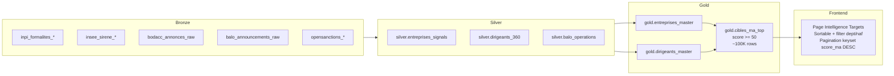
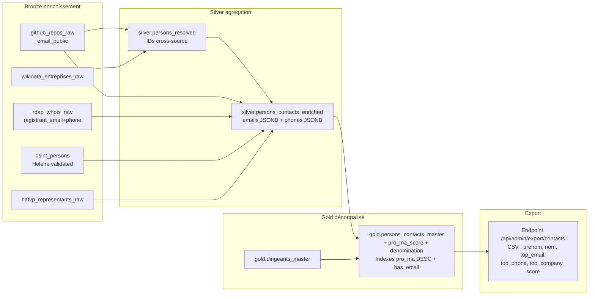
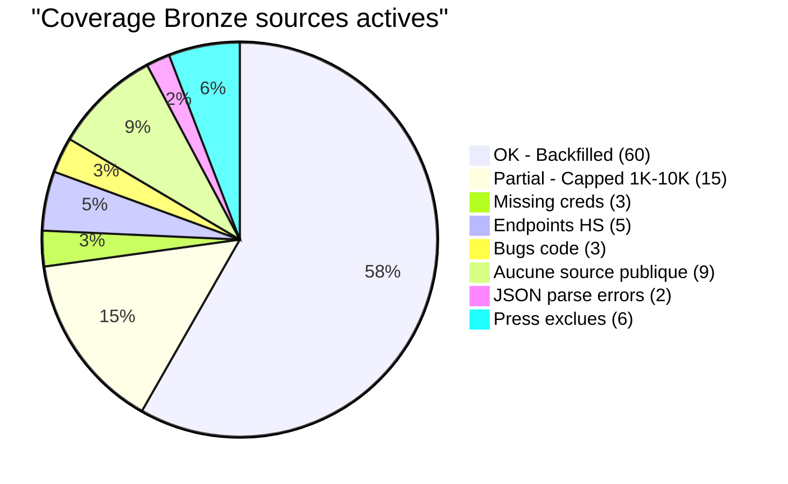

# 🗂️ Data Catalog — LINEAGE COMPLET (Mermaid)

> **Document compagnon de [`DATACATALOG.md`](./DATACATALOG.md)** — visualise le lineage end-to-end pour chaque cas d'usage produit DEMOEMA.
>
> Pour le catalogue exhaustif de tables (schémas SQL), voir `DATACATALOG.md` original.
> Dernière maj : 29/04/2026 — état post-migration nouveau VPS + 27 silvers + 13 golds.

---

## 📊 Vue globale — Lineage end-to-end Bronze → Gold → Frontend

Tous les flux data DEMOEMA en un seul diagramme.

```mermaid
flowchart LR
    %% ========== SOURCES EXTERNES ==========
    subgraph SOURCES["📡 Sources externes (cataloguées : 144 / actives : 109)"]
        direction TB
        S_INPI[INPI RNE<br/>OAuth2]
        S_INSEE[INSEE SIRENE<br/>OAuth2]
        S_BODACC[BODACC<br/>OpenData]
        S_DILA[DILA bulks<br/>11 onglets]
        S_DVF[DVF<br/>OpenData]
        S_AMF[AMF<br/>4 sources]
        S_OSANCT[OpenSanctions]
        S_GLEIF[GLEIF LEI]
        S_HATVP[HATVP]
        S_OSINT[OSINT Phase 1<br/>Wikidata/HAL/GH/crt.sh]
        S_TS[Transparence Santé]
        S_ICIJ[ICIJ Offshore]
        S_PRESS[Press RSS<br/>6 sources]
        S_OTHER[+90 autres]
    end

    %% ========== BRONZE ==========
    subgraph BRONZE["🥉 BRONZE — 115 tables / 512 GB"]
        direction TB

        subgraph B_INPI["INPI"]
            BI_DIRIGEANTS[inpi_formalites_personnes<br/>15M]
            BI_ENT[inpi_formalites_entreprises<br/>27M]
            BI_ETAB[inpi_formalites_etablissements<br/>38M]
            BI_LIASSES[inpi_comptes_liasses<br/>331M]
            BI_DEPOTS[inpi_comptes_depots<br/>6M]
        end

        subgraph B_INSEE_BRONZE["INSEE"]
            BIN_SIRET[insee_sirene_siret_raw<br/>43M]
        end

        subgraph B_BODACC_BRONZE["BODACC + DILA"]
            BB_BODACC[bodacc_annonces_raw<br/>30M]
            BD_CASS[judilibre_decisions_raw<br/>145K]
            BD_CAPP[juri_capp_raw<br/>73K]
            BD_JADE[juri_jade_raw<br/>14K]
            BD_AMF[amf_dila_raw<br/>29K]
            BD_LEGI[legifrance_textes_raw<br/>235K]
            BD_JORF[jorf_textes_raw<br/>309K]
            BD_KALI[kali_ccn_raw<br/>158K]
        end

        subgraph B_DVF_BRONZE["DVF"]
            BDV_DVF[dvf_transactions_raw<br/>15M]
        end

        subgraph B_OSINT_BRONZE["OSINT"]
            BO_PERSONS[osint_persons<br/>2K]
            BO_HATVP[hatvp_representants_raw<br/>459K]
            BO_OSANCT[opensanctions_entities_raw<br/>281K]
            BO_GLEIF[gleif_lei_raw<br/>10K]
            BO_TS[transparence_sante_raw<br/>11.5K]
            BO_ICIJ[icij_offshore_raw<br/>44]
            BO_HAL[hal_publications_raw<br/>36K]
            BO_OPENALEX[openalex_works_raw<br/>1K]
            BO_GH[github_repos_raw<br/>0]
            BO_WIKI[wikidata_entreprises_raw<br/>0]
            BO_CRT[crt_sh_certificates_raw<br/>0]
            BO_RDAP[rdap_whois_raw<br/>0]
        end
    end

    %% ========== SILVER LEVEL 0 ==========
    subgraph SILVER_L0["🥈 SILVER Level 0 — bronze sources directs (16 MV)"]
        direction TB
        SL0_DIR[silver.inpi_dirigeants 8.1M]
        SL0_SCI[silver.dirigeant_sci_patrimoine 3.5M]
        SL0_COMPTES[silver.inpi_comptes 6.3M]
        SL0_ETAB[silver.insee_etablissements 43M]
        SL0_UNIT[silver.insee_unites_legales 29M]
        SL0_BODACC[silver.bodacc_annonces 66K]
        SL0_DVF[silver.dvf_transactions 15M]
        SL0_GLEIF[silver.gleif_lei 10K]
        SL0_OSANCT[silver.opensanctions 281K]
        SL0_JUDI[silver.judilibre_decisions 15K]
        SL0_OSINTC[silver.osint_companies_enriched 2.7K]
        SL0_OSINTP[silver.osint_persons_enriched 2K]
        SL0_PRESS[silver.press_mentions_matched 0]
        SL0_CESSION[silver.cession_events 0]
    end

    %% ========== SILVER LEVEL 1 (M&A enrichis) ==========
    subgraph SILVER_L1["🥈 SILVER Level 1 — silvers M&A enrichis (11 specs)"]
        direction TB
        SL1_BALO[silver.balo_operations]
        SL1_AMF[silver.amf_signals]
        SL1_JURI[silver.juridictions_unifiees]
        SL1_MAND[silver.mandats_changes]
        SL1_MARCH[silver.marches_publics_unifies]
        SL1_PARC[silver.parcelles_dirigeants]
        SL1_HATVP[silver.hatvp_conflits_interets]
        SL1_TS[silver.transparence_sante_dirigeants]
        SL1_INNOV[silver.crossref_hal_innovation]
        SL1_ICIJ[silver.icij_offshore_match]
        SL1_LEGI[silver.legi_jorf_secteurs]
    end

    %% ========== SILVER LEVEL 2 (silver-of-silver) ==========
    subgraph SILVER_L2["🥈 SILVER Level 2 — silver-of-silver"]
        direction TB
        SL2_360[silver.dirigeants_360<br/>feature store dirigeant]
        SL2_ESIG[silver.entreprises_signals<br/>feature store entreprise]
        SL2_RESOL[silver.persons_resolved<br/>cross-source matching]
    end

    %% ========== SILVER LEVEL 3 (max depth) ==========
    subgraph SILVER_L3["🥈 SILVER Level 3 — max depth"]
        SL3_CONT[silver.persons_contacts_enriched<br/>emails + phones]
    end

    %% ========== GOLD LEVEL 0 (sources silvers) ==========
    subgraph GOLD_L0["🥇 GOLD Level 0 — feature store final (10 specs)"]
        direction TB
        G_ENT[gold.entreprises_master<br/>5M cibles]
        G_DIR[gold.dirigeants_master<br/>8M dirigeants]
        G_FEED[gold.signaux_ma_feed<br/>events partitioned]
        G_FLAGS[gold.compliance_red_flags]
        G_JURI[gold.juridictions_master<br/>tsvector FTS]
        G_NET[gold.network_mandats<br/>50M edges]
        G_VEILLE[gold.veille_reglementaire]
        G_BALO[gold.balo_operations_realtime]
        G_BENCH[gold.benchmarks_sectoriels]
    end

    %% ========== GOLD LEVEL 1 (gold-of-gold) ==========
    subgraph GOLD_L1["🥇 GOLD Level 1 — gold-of-gold (3 specs)"]
        G_TARGETS[gold.cibles_ma_top<br/>page Intelligence Targets]
        G_PARC[gold.parcelles_cibles<br/>asset-rich filter]
        G_CONTACTS[gold.persons_contacts_master<br/>export CSV prospection]
        G_PERS[gold.persons_master_universal<br/>360 dirigeant final]
    end

    %% ========== API ==========
    subgraph API["🔌 API FastAPI"]
        A_ENT[/api/entreprises/*]
        A_DIR[/api/dirigeants/*]
        A_TARGETS[/api/targets]
        A_SIGNALS[/api/signals]
        A_COPILOT[/api/copilot]
        A_COMPLIANCE[/api/compliance]
    end

    %% ========== FRONTEND ==========
    subgraph FRONT["💻 Frontend Next.js 15"]
        F_DASH[Dashboard]
        F_TARGETS[Intelligence Targets]
        F_SIGNALS[Feed Signaux]
        F_GRAPH[Graphe Réseau]
        F_COPILOT[Copilot IA]
        F_FICHE[Fiche Entreprise]
        F_DD[Module DD/Compliance]
    end

    %% ===================== EDGES =====================

    %% Sources → Bronze
    S_INPI --> BI_DIRIGEANTS
    S_INPI --> BI_ENT
    S_INPI --> BI_ETAB
    S_INPI --> BI_LIASSES
    S_INPI --> BI_DEPOTS
    S_INSEE --> BIN_SIRET
    S_BODACC --> BB_BODACC
    S_DILA --> BD_CASS
    S_DILA --> BD_CAPP
    S_DILA --> BD_JADE
    S_DILA --> BD_AMF
    S_DILA --> BD_LEGI
    S_DILA --> BD_JORF
    S_DILA --> BD_KALI
    S_DVF --> BDV_DVF
    S_AMF --> BD_AMF
    S_OSANCT --> BO_OSANCT
    S_GLEIF --> BO_GLEIF
    S_HATVP --> BO_HATVP
    S_OSINT --> BO_HAL
    S_OSINT --> BO_OPENALEX
    S_OSINT --> BO_GH
    S_OSINT --> BO_WIKI
    S_OSINT --> BO_CRT
    S_TS --> BO_TS
    S_ICIJ --> BO_ICIJ

    %% Bronze → Silver Level 0
    BI_DIRIGEANTS --> SL0_DIR
    BI_ENT --> SL0_ETAB
    BI_ETAB --> SL0_ETAB
    BI_LIASSES --> SL0_COMPTES
    BI_DEPOTS --> SL0_COMPTES
    BIN_SIRET --> SL0_UNIT
    BIN_SIRET --> SL0_ETAB
    BB_BODACC --> SL0_BODACC
    BB_BODACC --> SL0_CESSION
    BDV_DVF --> SL0_DVF
    BO_GLEIF --> SL0_GLEIF
    BO_OSANCT --> SL0_OSANCT
    BD_CASS --> SL0_JUDI
    BO_PERSONS --> SL0_OSINTP

    %% Bronze → Silver Level 1
    BD_AMF --> SL1_AMF
    BD_CASS --> SL1_JURI
    BD_CAPP --> SL1_JURI
    BD_JADE --> SL1_JURI
    BD_LEGI --> SL1_LEGI
    BD_JORF --> SL1_LEGI
    BO_HATVP --> SL1_HATVP
    BO_TS --> SL1_TS
    BO_ICIJ --> SL1_ICIJ
    BO_HAL --> SL1_INNOV
    BO_OPENALEX --> SL1_INNOV

    %% Silver Level 0 → Silver Level 1 (some)
    SL0_DIR --> SL1_HATVP
    SL0_DIR --> SL1_TS
    SL0_DIR --> SL1_ICIJ
    SL0_DIR --> SL1_INNOV
    SL0_DIR --> SL1_PARC
    SL0_DIR --> SL1_MAND
    SL0_SCI --> SL1_PARC

    %% Silver Level 0+1 → Silver Level 2
    SL0_DIR --> SL2_360
    SL0_SCI --> SL2_360
    SL0_COMPTES --> SL2_360
    SL0_BODACC --> SL2_360
    SL0_OSANCT --> SL2_360
    SL0_OSINTP --> SL2_360
    SL1_INNOV --> SL2_360
    SL1_ICIJ --> SL2_360

    SL0_UNIT --> SL2_ESIG
    SL0_ETAB --> SL2_ESIG
    SL0_COMPTES --> SL2_ESIG
    SL0_GLEIF --> SL2_ESIG
    SL0_BODACC --> SL2_ESIG
    SL0_OSANCT --> SL2_ESIG
    SL1_BALO --> SL2_ESIG
    SL1_AMF --> SL2_ESIG

    SL0_DIR --> SL2_RESOL
    BO_WIKI --> SL2_RESOL
    BO_GH --> SL2_RESOL
    BO_PERSONS --> SL2_RESOL

    %% Silver Level 2 → Silver Level 3
    BO_GH --> SL3_CONT
    BO_RDAP --> SL3_CONT
    BO_PERSONS --> SL3_CONT
    SL1_HATVP --> SL3_CONT
    BO_WIKI --> SL3_CONT
    SL2_RESOL --> SL3_CONT

    %% Silver → Gold Level 0
    SL2_ESIG --> G_ENT
    SL0_UNIT --> G_ENT
    SL0_ETAB --> G_ENT
    SL0_COMPTES --> G_ENT
    SL0_GLEIF --> G_ENT
    SL1_BALO --> G_ENT
    SL1_AMF --> G_ENT
    SL1_JURI --> G_ENT
    SL0_OSANCT --> G_ENT
    SL0_CESSION --> G_ENT
    SL0_BODACC --> G_ENT

    SL2_360 --> G_DIR
    SL1_PARC --> G_DIR
    SL1_HATVP --> G_DIR
    SL1_TS --> G_DIR
    SL1_INNOV --> G_DIR
    SL1_ICIJ --> G_DIR
    SL1_MAND --> G_DIR

    SL1_BALO --> G_FEED
    SL0_CESSION --> G_FEED
    SL0_BODACC --> G_FEED
    SL1_AMF --> G_FEED
    SL1_MAND --> G_FEED
    SL0_PRESS --> G_FEED

    SL0_OSANCT --> G_FLAGS
    SL1_AMF --> G_FLAGS
    SL1_ICIJ --> G_FLAGS
    SL0_BODACC --> G_FLAGS

    SL1_JURI --> G_JURI
    SL0_DIR --> G_NET
    SL1_LEGI --> G_VEILLE
    SL1_BALO --> G_BALO
    SL0_COMPTES --> G_BENCH

    %% Gold Level 0 → Gold Level 1
    G_ENT --> G_TARGETS
    G_DIR --> G_TARGETS
    G_DIR --> G_PARC
    G_ENT --> G_PARC
    SL1_PARC --> G_PARC
    G_DIR --> G_CONTACTS
    SL3_CONT --> G_CONTACTS
    G_DIR --> G_PERS
    SL2_RESOL --> G_PERS

    %% Gold → API
    G_ENT --> A_ENT
    G_DIR --> A_DIR
    G_PERS --> A_DIR
    G_TARGETS --> A_TARGETS
    G_FEED --> A_SIGNALS
    G_FLAGS --> A_COMPLIANCE
    G_NET --> A_COPILOT
    G_JURI --> A_COPILOT

    %% API → Frontend
    A_ENT --> F_FICHE
    A_DIR --> F_FICHE
    A_TARGETS --> F_TARGETS
    A_SIGNALS --> F_SIGNALS
    A_COPILOT --> F_COPILOT
    A_COMPLIANCE --> F_DD
    A_DIR --> F_GRAPH

    %% Styling
    classDef bronze fill:#cd7f32,color:#fff
    classDef silver fill:#c0c0c0,color:#000
    classDef gold fill:#ffd700,color:#000
    classDef api fill:#3498db,color:#fff
    classDef front fill:#9b59b6,color:#fff
    classDef sources fill:#95a5a6,color:#fff

    class SOURCES sources
    class BRONZE,B_INPI,B_INSEE_BRONZE,B_BODACC_BRONZE,B_DVF_BRONZE,B_OSINT_BRONZE bronze
    class SILVER_L0,SILVER_L1,SILVER_L2,SILVER_L3 silver
    class GOLD_L0,GOLD_L1 gold
    class API api
    class FRONT front
```

---

## 🎯 Lineage par cas d'usage produit

### Use case 1 — Page "Intelligence Targets" (top cibles M&A)



### Use case 2 — Page "Feed Signaux" (events temps réel)

```mermaid
flowchart LR
    subgraph SOURCES_2["Bronze sources"]
        BS1[balo_announcements_raw<br/>signaux capitalistiques]
        BS2[bodacc_annonces_raw<br/>cessions, procédures]
        BS3[amf_dila_raw<br/>sanctions AMF]
        BS4[inpi_formalites_historique<br/>changements mandat]
    end

    subgraph SILVER_2["Silver"]
        SL_BALO[silver.balo_operations<br/>classification opa/dividende/etc]
        SL_CESS[silver.cession_events]
        SL_AMF[silver.amf_signals<br/>severity HIGH/MED/LOW]
        SL_MAND[silver.mandats_changes<br/>nomination/démission]
    end

    subgraph GOLD_2["Gold"]
        GD_FEED[gold.signaux_ma_feed<br/>UNION partitioned by date<br/>indexes severity + siren + type]
    end

    subgraph API_2["API + Frontend"]
        API_S[/api/signals?siren=X<br/>+ severity + type]
        FR_S[Page Feed Signaux<br/>filter par dimension<br/>push notifications]
    end

    BS1 --> SL_BALO
    BS2 --> SL_CESS
    BS3 --> SL_AMF
    BS4 --> SL_MAND

    SL_BALO --> GD_FEED
    SL_CESS --> GD_FEED
    SL_AMF --> GD_FEED
    SL_MAND --> GD_FEED

    GD_FEED --> API_S
    API_S --> FR_S
```

### Use case 3 — Module Compliance / Due Diligence

```mermaid
flowchart LR
    subgraph SOURCES_3["Sources red flags"]
        OSA[bronze.opensanctions_entities_raw<br/>281K]
        AMF[bronze.amf_listes_noires_raw<br/>+ amf_dila + bdif + geco]
        ICIJ[bronze.icij_offshore_raw<br/>Panama/Pandora/Paradise]
        BODACC2[bronze.bodacc_annonces_raw<br/>procedures collectives]
        GELS[bronze.gels_avoirs_raw]
    end

    subgraph SILVER_3["Silver enrichi"]
        SL_OSA[silver.opensanctions]
        SL_AMF2[silver.amf_signals<br/>4 sources unifiées]
        SL_ICIJ[silver.icij_offshore_match<br/>via dirigeants]
    end

    subgraph GOLD_3["Gold compliance"]
        GD_FLAGS[gold.compliance_red_flags<br/>par siren + severity_max]
    end

    subgraph API_3["API + DD UI"]
        API_C[/api/compliance/check?siren=X<br/>structured red flags JSONB]
        FR_DD[Page DD Compliance<br/>RGB severity badges<br/>export PDF KYC]
    end

    OSA --> SL_OSA
    AMF --> SL_AMF2
    ICIJ --> SL_ICIJ
    BODACC2 --> GD_FLAGS

    SL_OSA --> GD_FLAGS
    SL_AMF2 --> GD_FLAGS
    SL_ICIJ --> GD_FLAGS
    GELS --> GD_FLAGS

    GD_FLAGS --> API_C
    API_C --> FR_DD
```

### Use case 4 — Graphe Réseau (multi-mandats + co-mandataires)

```mermaid
flowchart LR
    subgraph SOURCES_4["Bronze + Silver"]
        BIN[bronze.inpi_formalites_personnes]
        BIE[bronze.inpi_formalites_entreprises]
        SD[silver.inpi_dirigeants 8.1M]
    end

    subgraph GOLD_4["Gold"]
        GD_NET[gold.network_mandats<br/>50M edges person × entreprise<br/>WITH RECURSIVE friendly]
    end

    subgraph API_4["API"]
        API_G[/api/graph/dirigeant/X<br/>WITH RECURSIVE depth 2]
    end

    subgraph FR_4["Frontend"]
        FR_GRAPH[Page Graphe Réseau<br/>ForceGraph2D glassmorphism]
    end

    BIN --> SD
    BIE --> SD
    SD --> GD_NET
    GD_NET --> API_G
    API_G --> FR_GRAPH
```

### Use case 5 — Export CSV prospection (emails + phones)



---

## 📂 Lineage par couche fonctionnelle (16 couches OSINT_STRATEGY)

```mermaid
flowchart TB
    subgraph C1["Couche 1 — Identification"]
        C1_S[INSEE SIRENE + INPI RNE + RNA]
        C1_B[bronze.insee_sirene_siret_raw<br/>bronze.inpi_*]
        C1_G[gold.entreprises_master<br/>gold.dirigeants_master]
    end

    subgraph C2["Couche 2 — IDs internationaux"]
        C2_S[GLEIF + Wikidata + OpenCorporates + ORCID]
        C2_B[bronze.gleif_lei_raw<br/>bronze.wikidata_*<br/>bronze.orcid_*]
        C2_G[silver.persons_resolved<br/>cross-source identifiers]
    end

    subgraph C3["Couche 3 — Finances"]
        C3_S[INPI Comptes annuels + ESANE INSEE + BdF]
        C3_B[bronze.inpi_comptes_*]
        C3_G[silver.inpi_comptes<br/>gold.benchmarks_sectoriels]
    end

    subgraph C4["Couche 4 — Marchés cotés"]
        C4_S[AMF + Euronext + SEC + Bundesanzeiger]
        C4_B[bronze.amf_*<br/>bronze.balo_announcements_raw]
        C4_G[silver.amf_signals<br/>gold.balo_operations_realtime]
    end

    subgraph C5["Couche 5 — Publications légales"]
        C5_S[BODACC + Infogreffe + DILA bulks]
        C5_B[bronze.bodacc_*<br/>bronze.juri_*<br/>bronze.legifrance_textes_raw]
        C5_G[silver.juridictions_unifiees<br/>gold.juridictions_master]
    end

    subgraph C6["Couche 6 — Contentieux"]
        C6_S[Judilibre + Cours d'appel + Conseil d'État + Constit]
        C6_B[bronze.judilibre_decisions_raw<br/>bronze.juri_capp_raw<br/>bronze.juri_jade_raw]
        C6_G[silver.juridictions_unifiees]
    end

    subgraph C7["Couche 7 — Ownership"]
        C7_S[INPI RNE Bénéficiaires<br/>+ Wikidata P127 P749]
        C7_G[silver.dirigeants_360<br/>+ gold.network_mandats]
    end

    subgraph C8["Couche 8 — Marchés publics"]
        C8_S[BOAMP + DECP]
        C8_B[bronze.boamp_avis_raw<br/>bronze.decp_marches_raw]
        C8_G[silver.marches_publics_unifies]
    end

    subgraph C9["Couche 9 — R&D / IP"]
        C9_S[INPI Brevets + EPO + HAL + OpenAlex + CrossRef]
        C9_B[bronze.inpi_brevets_raw<br/>bronze.openalex_works_raw<br/>bronze.hal_publications_raw]
        C9_G[silver.crossref_hal_innovation]
    end

    subgraph C10["Couche 10 — Géo / immo"]
        C10_S[DVF + BAN + Cadastre IGN]
        C10_B[bronze.dvf_transactions_raw<br/>bronze.api_cadastre_ign_raw]
        C10_G[silver.parcelles_dirigeants<br/>gold.parcelles_cibles]
    end

    subgraph C11["Couche 11 — Compliance / sanctions"]
        C11_S[OpenSanctions + OFAC + UK HMT + EU Sanctions + Gels Avoirs]
        C11_B[bronze.opensanctions_*<br/>bronze.gels_avoirs_raw]
        C11_G[silver.opensanctions<br/>gold.compliance_red_flags]
    end

    subgraph C12["Couche 12 — Politique / lobby"]
        C12_S[HATVP + transparence_ue + ICIJ Offshore]
        C12_B[bronze.hatvp_representants_raw<br/>bronze.icij_offshore_raw]
        C12_G[silver.hatvp_conflits_interets<br/>silver.icij_offshore_match]
    end

    subgraph C13["Couche 13 — Santé pharma"]
        C13_S[Transparence Santé + ANSM + BDPM]
        C13_B[bronze.transparence_sante_raw<br/>bronze.ansm_decisions_raw]
        C13_G[silver.transparence_sante_dirigeants]
    end

    subgraph C16["Couche 16 — Web / digital"]
        C16_S[crt.sh + RDAP/WHOIS + GitHub + GDELT]
        C16_B[bronze.crt_sh_certificates_raw<br/>bronze.rdap_whois_raw<br/>bronze.github_repos_raw]
        C16_G[silver.persons_contacts_enriched]
    end

    style C1 fill:#e3f2fd
    style C2 fill:#e3f2fd
    style C5 fill:#fff3cd
    style C6 fill:#fff3cd
    style C11 fill:#f8d7da
    style C12 fill:#f8d7da
```



---

## 🔄 Refresh schedule data flow (à quoi se réfère chaque cron)

```mermaid
gantt
    title Refresh schedule par couche data
    dateFormat HH:mm
    axisFormat %H:%M

    section Bronze (109 sources)
    DILA juri (CASS/CAPP/JADE/CONSTIT) lundi 06-09h    :02:00, 4h
    INPI dirigeants quotidien                          :04:00, 1h
    BODACC quotidien                                   :05:00, 1h
    BALO quotidien                                     :05:30, 30m
    AMF DILA hebdo                                     :07:00, 30m
    OSINT Phase 1 hebdo                                :08:00, 30m

    section Silver (29 specs)
    Bootstrap au boot 4-wide                           :milestone, 06:00, 0
    Refresh dirigeants_360 (24h)                       :03:00, 1h
    Refresh entreprises_signals (24h)                  :03:30, 1h
    Maintainer staleness toutes 30min                  :crit, 00:00, 24h

    section Gold (13 specs)
    Bootstrap retry toutes 30min                       :crit, 00:00, 24h
    Refresh entreprises_master                         :03:00, 30m
    Refresh dirigeants_master                          :03:30, 30m
    Refresh cibles_ma_top                              :04:00, 30m
    Refresh signaux_ma_feed (1h)                       :crit, 00:00, 24h
    Refresh persons_contacts_master                    :05:00, 30m

    section OSINT
    Maigret nightly batch 1000                         :02:00, 4h

    section Misc
    Neo4j rebuild                                      :04:00, 1h
    Supervisor daily report                            :08:00, 30m
```



---

## 📊 Coverage actuelle vs cible (29/04/2026)



---

## 🎯 KPIs lineage

| Métrique | Valeur | Cible Q3 2026 |
|---|---:|---:|
| Bronze tables actives | **115** | 144 |
| Silver MV totales | **29** | 35 |
| Gold tables totales | **13** | 20 |
| % sources fonctionnelles | 60/109 = **55%** | 90%+ |
| Volume bronze datalake | **512 GB** | 1 TB |
| Coverage dirigeants enrichis OSINT | 2K = **0.025%** | 1M = 12% |
| Refresh quotidien automatisé | **168 jobs** | 168+ |
| Pipeline 100% auto (bronze + silver + gold + OSINT) | ✅ | ✅ |

---

> Lineage généré le 29/04/2026. Document source de vérité pour le data flow DEMOEMA.
> À mettre à jour à chaque évolution silver/gold (codegen LLM auto-discovery + diagrams manuels).
