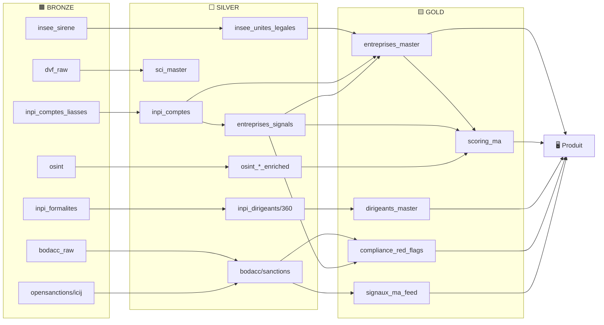

# Origin — Lineage de la donnée (traçabilité champ par champ)

> Pour chaque chiffre clé : le chemin **complet** de la source officielle jusqu'à l'écran,
> avec la transformation appliquée à chaque étape. C'est la preuve de traçabilité.

Légende : 🟫 Bronze (brut) · ⬜ Silver (nettoyé/calculé) · 🟨 Gold (agrégé/scoré) · 🖥️ Produit.

---

## 1. Lineage — Chiffre d'affaires (CA)

```mermaid
flowchart TD
  A["🟫 bronze.inpi_comptes_liasses<br/>331,9 M lignes · code CERFA <b>FJ</b><br/>(Chiffre d'affaires net)"]
  A --> B["⬜ silver.inpi_comptes<br/>ca_net = COALESCE(FJ.m3, FR)<br/>1 ligne / dépôt / exercice"]
  B --> C["⬜ silver.entreprises_signals<br/>ca_latest = dernier exercice<br/>+ ca_avant_dernier, croissance"]
  C --> D["🟨 gold.entreprises_master<br/>ca_latest"]
  D --> E["🟨 gold.scoring_ma<br/>ca_latest → axe Scale"]
  E --> F["🖥️ Fiche · Carte · Chat · Pitch"]
  B --> G["🖥️ Historique CA 5 ans<br/>(fetch direct /cibles)"]

  style A fill:#3a2a1a,stroke:#a87
  style B fill:#2a2a30,stroke:#88a
  style C fill:#2a2a30,stroke:#88a
  style D fill:#3a3520,stroke:#cb6
  style E fill:#3a3520,stroke:#cb6
  style F fill:#1a2a3a,stroke:#6ad
  style G fill:#1a2a3a,stroke:#6ad
```

**Validation** : croisé `recherche-entreprises.api.gouv.fr` → 88,6 % exact à ±5 %.

---

## 2. Lineage — EBITDA

```mermaid
flowchart TD
  A["🟫 bronze.inpi_comptes_liasses<br/>code GG (résultat exploitation = EBIT)<br/>+ GA/GB/GC/GD (dotations amort./prov.)"]
  A --> B["⬜ silver.inpi_comptes<br/>resultat_exploitation + dotations_exploitation"]
  B --> C["⬜ silver.entreprises_signals<br/><b>EBITDA = EBIT + dotations</b><br/>+ marge EBITDA, dette/EBITDA"]
  C --> D["🟨 gold.scoring_ma<br/>proxy_ebitda (réel) + EV indicative"]
  D --> E["🖥️ Fiche · Carte · ratios"]

  style A fill:#3a2a1a,stroke:#a87
  style B fill:#2a2a30,stroke:#88a
  style C fill:#2a2a30,stroke:#88a
  style D fill:#3a3520,stroke:#cb6
  style E fill:#1a2a3a,stroke:#6ad
```

**Exemple Roederer** : EBIT 72,5 M€ + dotations 6,1 M€ = **EBITDA 78,7 M€** (marge 41,8 %).

---

## 3. Lineage — Deal Score (4 axes)

```mermaid
flowchart TD
  subgraph SRC[" "]
    A1["🟫 inpi_comptes_liasses<br/>(financier)"]
    A2["🟫 insee_sirene<br/>(NAF, capital, état)"]
    A3["🟫 inpi_formalites<br/>(dirigeants, âge)"]
    A4["🟫 bodacc + opensanctions<br/>(risque)"]
  end
  A1 --> B1["⬜ inpi_comptes<br/>CA, EBITDA, bilan"]
  A2 --> B2["⬜ insee_unites_legales"]
  A3 --> B3["⬜ inpi_dirigeants / dirigeants_360"]
  A4 --> B4["⬜ bodacc / sanctions"]
  B1 --> C["⬜ entreprises_signals<br/>13 ratios + drapeaux"]
  B2 --> D["🟨 entreprises_master"]
  B3 --> D
  C --> D
  D --> E["🟨 scoring_ma"]
  B4 --> E
  E --> F1["Axe Transmission<br/>(âge dir. + SCI)"]
  E --> F2["Axe Attractivity<br/>(marge + stabilité)"]
  E --> F3["Axe Scale<br/>(CA)"]
  E --> F4["Axe Structure<br/>(forme + holding)"]
  F1 & F2 & F3 & F4 --> G["<b>deal_score =<br/>(T×A×Sc)^⅓ × risque</b><br/>→ tier percentile"]
  G --> H["🖥️ Produit"]

  style A1 fill:#3a2a1a,stroke:#a87
  style A2 fill:#3a2a1a,stroke:#a87
  style A3 fill:#3a2a1a,stroke:#a87
  style A4 fill:#3a2a1a,stroke:#a87
  style C fill:#2a2a30,stroke:#88a
  style D fill:#3a3520,stroke:#cb6
  style E fill:#3a3520,stroke:#cb6
  style G fill:#3a3520,stroke:#fb6,stroke-width:2px
  style H fill:#1a2a3a,stroke:#6ad
```

---

## 4. Lineage — Dirigeant & contactabilité

```mermaid
flowchart TD
  A["🟫 inpi_formalites_personnes<br/>(15 M · identité, mandats)"]
  A --> B["⬜ inpi_dirigeants → dirigeants_360<br/>(8,1 M · âge, rôles, multi-mandats)"]
  B --> C["🟨 dirigeants_master + network_mandats<br/>(réseau co-mandats)"]
  D["🟫 dvf + dirigeant_sci_patrimoine"] --> E["⬜ sci_master<br/>(patrimoine SCI)"]
  E --> C
  C --> N["🔵 Neo4j graphe<br/>(Person)-[IS_DIRIGEANT]->(Company)"]
  F["⬜ osint_companies_enriched<br/>(domaine société)"] --> G["🖥️ Contact probable<br/>prenom.nom@domaine<br/>(généré, à vérifier)"]
  C --> G

  style A fill:#3a2a1a,stroke:#a87
  style D fill:#3a2a1a,stroke:#a87
  style B fill:#2a2a30,stroke:#88a
  style E fill:#2a2a30,stroke:#88a
  style F fill:#2a2a30,stroke:#88a
  style C fill:#3a3520,stroke:#cb6
  style G fill:#2a1a2a,stroke:#d8d
```

---

## 5. Lineage — Compliance & risque

```mermaid
flowchart TD
  A["🟫 opensanctions_entities + icij_offshore"] --> B["⬜ sanctions / opensanctions / icij_offshore_match"]
  C["🟫 bodacc_annonces_raw"] --> D["⬜ bodacc_annonces<br/>(procédures, cessions)"]
  E["⬜ entreprises_signals<br/>(détresse : CP négatifs, EBITDA<0, surendettement)"]
  B --> F["🟨 compliance_red_flags<br/>risk_score 0-100 + drapeaux"]
  D --> F
  E --> F
  F --> G["🖥️ Panel compliance · risk haircut du deal_score"]

  style A fill:#3a2a1a,stroke:#a87
  style C fill:#3a2a1a,stroke:#a87
  style B fill:#2a2a30,stroke:#88a
  style D fill:#2a2a30,stroke:#88a
  style E fill:#2a2a30,stroke:#88a
  style F fill:#3a3520,stroke:#cb6
  style G fill:#1a2a3a,stroke:#6ad
```

---

## 6. Lineage — Killer feature « alertes pré-cession »

```mermaid
flowchart LR
  A["⬜ bodacc_annonces<br/>(cessions 36 mois)"] --> N["🔵 Neo4j"]
  B["⬜ entreprises_signals<br/>(is_distressed)"] --> N
  C["⬜ inpi_dirigeants<br/>(mandats)"] --> N
  N --> R1["(Person)-[A_CEDE]->(Company)<br/>serial seller ≥ 2 cessions"]
  N --> R2["Company.is_distressed"]
  R1 --> Q["<b>Requête killer :</b><br/>cible saine pilotée par<br/>un vendeur en série"]
  R2 --> Q
  Q --> P["🖥️ Alerte pré-cession"]

  style A fill:#2a2a30,stroke:#88a
  style B fill:#2a2a30,stroke:#88a
  style C fill:#2a2a30,stroke:#88a
  style N fill:#1a2a3a,stroke:#6ad
  style Q fill:#3a3520,stroke:#fb6,stroke-width:2px
  style P fill:#1a2a3a,stroke:#6ad
```

---

## 7. Lineage global (vue table-à-table)

---

*Origin — lineage généré depuis la définition réelle des transformations (silver_transforms, gold_transforms).*
